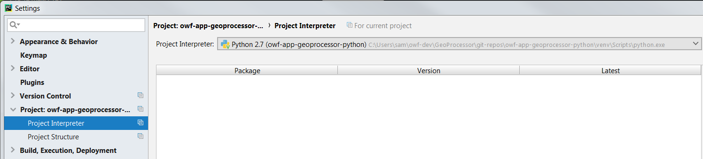

# Learn GeoProcessor (Dev) / Development Environment #

This documentation explains how to set up the development environment.
Some of the information looks ahead (to after development environment setup) to provide context.

* [Python](#python) - system and user version
* [QGIS](#qgis) - includes Python 2.7 and QGIS packages for Python
* [PyCharm](#pycharm) - integrated development environment (IDE), uses QGIS packages via `PYTHONPATH`
* [MkDocs](#mkdocs) - for documentation, uses system/user Python
* [Git](#git) - for version control
* [Running the GeoProcessor](#running-the-geoprocessor) - for testing and deployed version

-----

## Python ##

A typical Python installation might use a version installed in a shared location (e.g., `C:\Python27` or `C:\Python36` on Windows),
or in a user's account (e.g., `C:\Users\user\AppData\Local\Programs\Python...` on Windows 10).
The latter is recommended for newer Python versions (by the installer and its documentation)
to isolate potential negative impacts on the system from Python
packages downloaded from the internet (less of an issue for well-respected packages).
The installation location of Python core software and third-party packages has evolved with each Python version.
Unfortunately, this can lead to confusion.
Consequently, it is recommended to use a script to run each Python application,
which allows configuration of the installed Python and add-ons to use.
For the GeoProcessor, this means that a script is use to run the GeoProcssor,
and a separate script is used to start PyCharm so that it can run the GeoProcessor (discussed in following sections).

In addition to a standard system or user Python installation, Python now also supports a virtual environment approach.
This approach can be used to fully isolate the Python installation used by an application.
More disk space is needed.
However, the application is fully isolated from changes to the system/user Python installations.
A virtual environment approach is often used with PyCharm development (see [PyCharm section](#pycharm) below).

* See [Pipenv and Virtual Environments](http://docs.python-guide.org/en/latest/dev/virtualenvs/).

The GeoProcessor will require using appropriate Python in the development and deployed environments,
typically the QGIS environment, with care taken to deploy GeoProcessor Python files.

The MkDocs software, which is used to prepare documentation,
will generally use a system/user version of Python since it can be used across multiple
Python projects.
The Python version that is used will be updated to include the MkDocs software packages and launch program.
In other words, the Python that is used for MkDocs may not be the QGIS or PyCharm Python versions.

The remainder of this document provides more detail on the various locations for Python installation.
When in doubt, use commands like `where py` or `where python` on Windows (`which python` on Linux)
to find which python is being used and then examine the `Lib` and `Lib/site-packages` folders
to see where packages are installed.

### Cygwin Python ###

If working on Windows, it is convenient to install Cygwin, which provides Linux software.
Cygwin can help increase productivity.
If Cygwin is used, then its system Python will likely be used given that Cygwin is essentially a per-user system.
For example, Cygwin Python is handy for installing and running MkDocs.

### Windows 7 Python 2.7 System Install Example ###

The following example illustrates a system Python installation for Python 2.7,
as an example of the locations that may be used for an installation.

* Main installation folder:  `C:\Python27`.
	+ Python executables exist here.
	+ Includes folders `Lib`, `Scripts`, etc. as per normal Python installation.
* Site packages:  `C:\Python27\site-packages` (similarly for `scripts`).
* `pip` cache:  `C:\Users\user\AppData\Local\pip\cache`.

### Windows 10 Python 3.6 User Install Example ###

The following folders illustrate a user-specific Python installation for Python 3.6,
as an example of the locations that may be used for an installation.
Note that the `AppData` folder may be hidden - use the ***View*** control in File Explorer to change the visibility.

* Main installation folder:  `C:\Users\user\AppData\Local\Programs\Python\Python36-32`.
	+ Python executables exist here.
	+ Includes folders `Lib`, `Scripts`, etc. as per normal Python installation.
* Site packages:  `C:\Users\user\AppData\Roaming\Python\Python36\site-packages` (similarly for `scripts`).
* `pip` cache:  `C:\Users\user\AppData\Local\pip\cache`.

## QGIS ##

The GeoProcessor is currently being developed for QGIS 2.x, which uses Python 2.7+.
The GeoProcessor will be updated over time to work with Python 2 and 3,
although QGIS 2.x is the priority given that QGIS 3.x appears to be unstable.
The GeoProcessor automated tests will be used to confirm that GeoProcessor
functionality works on QGIS 2 and 3 (same tests will be run on both).
The following resources explain how to install QGIS, and 64-bit QGIS is recommended if the
computer operating system is 64-bit.

* [QGIS download page](https://www.qgis.org/en/site/forusers/download.html)
	+ Make sure to do the ***Advanced Install*** and install the stable long-term release to install
	the Python 2 version needed by the GeoProcessor (2.18+).
	For example, this will install `qgis-ltr.bat` (QGIS 2.x) in addition to `qgis.bat` (QGIS 3.x).
* See also:  [OWF Learn QGIS / Install QGIS](http://learn.openwaterfoundation.org/owf-learn-qgis/install-qgis/).
* See also:  [QGIS Version Install Experiments](resources/qgis-version-install-experiments) for detailed background.

GeoProcessor developers can typically use the OsGeo4W suite that is the default QGIS installer,
making sure to install the stable long-term release to ensure that a Python 2 version of QGIS is available for development.
QGIS 3 will be phased in over time.

The QGIS Python installation version will vary depending on QGIS version but is generally
configured similar to the following on Windows:

* `C:\OSGeo4W64\bin\python.exe` (Python 2) and `C:\OSGeo4W64\bin\python3.exe` (Python 3) -
QGIS Python interpreter, found in QGIS `bin` folder for convenience.
Other Python executables that would normally be found in the Python `bin` folder
also exist in `C:\OSGeo4W64\bin`.
* `C:\OSGeo4W64\apps\Python27\` - typical Python 2 installation folder structure, minus `bin`
(since those programs exist in the folder described above):
	+ `C:\OSGeo4W64\apps\Python27\Lib\*` - third-party Python packages
	+ `C:\OSGeo4W64\apps\Python27\Lib\site-packages\*` - additional contributed Python packages
	(this is one option to install the GeoProcessor in the deployed environment)
* `C:\OSGeo4W64\apps\Python36\` - similar to above but for Python 3.

The GeoProcessor should use the QGIS configuration during development:

* PyCharm must use QGIS libraries in `PYTHONPATH` ([discussed more here](#pycharm))
* Running tests in the development environment via `gpdev` program, which uses the development GeoProcessor code
([discussed more here](#running-the-geoprocessor)) can use the QGIS Python and libraries.

The deployed environment will install the GeoProcessor in the QGIS `site-packages` folder and
can be run using the `gp` program.

## PyCharm ##

PyCharm is the Python integrated development environment tool that has been chosen by OWF for development.
However, other developers can use other tools if they desire.
The PyCharm Community Edition is adequate for development.
The GitHub repository for the project is used as the PyCharm project folder
and PyCharm project files are ignored using `.gitignore`.
This means that the developer must set up the PyCharm project themselves rather than
relying on PyCharm project files in the repository.
This approach has been chosen because it is the least prescriptive to the developer community
and Python developers are expected to at least know how to set up a project in their development tool of choice.

The PyCharm IDE runs Python in the development environment,
and therefore each project must be configured to know which Python interpreter to use.
PyCharm is typically be configured to use a Python version in the virtual environment folder (`venv`) that is
set up when the GeoProcessor Python project is setup, as shown in the following figure.
If a virtual environment is not set up, then the Python that was selected when
the project was set up will be used (such as user's copy of Python).
A virtual environment is recommended in order to better control development environment Python
packages, which helps understand which packages are needed in the deployed system.
The following image illustrates the interpreter installed in a `venv` folder
(open the image in a new tab to view a larger image).

QGIS is distributed with Python for its run-time environment,
rather than using the user's or computer's Python or PyCharm Python.
The QGIS libraries must be made known to PyCharm in order for the GeoProcessor code to
function without errors.
However, the PyCharm virtual environment Python (2.7) will be used for development.

The QGIS Python can be used in a deployed environment, as long as the GeoProcessor module (`geoprocessor`) is
installed in QGIS `site-packages` folder or `PYTHONPATH` includes the GeoProcessor module.
Using the QGIS environment as much as possible helps ensure that there are no compatibility issues with the QGIS software,
which is important because much of the GeoProcessor processing is performed with QGIS tools.

To run QGIS software, PyCharm and applications that use QGIS (including the GeoProcessor),
it is best to use a batch file (Windows) or shell script (Linux).
This ensures that the correct version of Python and additional Python modules are properly configured.
This is discussed in the [New Developer](../dev-new) section.

### Install PyCharm ##

Install the PyCharm 64-bit Community Edition:

* [Windows](https://www.jetbrains.com/pycharm/download/#section=windows)

This will install into a folder similar to `C:\Program Files\JetBrains\PyCharm Community Edition 2017.3.1`.
Once installed the software may periodically ask to install updates.
Doing so does not appear to change the original install folder (even if the version changes)...updates seem
to install in the same folder.

### Script to Run PyCharm ###

As indicated in previous sections, it is necessary to use the QGIS Python and packages in order to use the QGIS functionality.
PyCharm must also leverage QGIS.
Therefore, a batch file or script can be used to configure the environment and run PyCharm.
This script must recognize the install location of PyCharm software, which may be different for each developer.
To start PyCharm, run one of the following scripts, with location shown relative to the project files once
cloned from the repository (explained in the [New Developer](../dev-new) section):

* Windows (via command prompt window):
	+ [owf-app-geoprocessor-python/build-util/run-pycharm-for-qgis.bat](https://github.com/OpenWaterFoundation/owf-app-geoprocessor-python/blob/master/build-util/run-pycharm-for-qgis.bat) - run PyCharm 2016.2.3 installed in the standard location
	+ [owf-app-geoprocessor-python/build-util/run-pycharm2017.3.1-for-qgis.bat](https://github.com/OpenWaterFoundation/owf-app-geoprocessor-python/blob/master/build-util/run-pycharm2017.3.1-for-qgis.bat) - run PyCharm 2017.3.1 installed in the standard location
* Linux (via terminal window):
	+ Not yet tested.

## MkDocs ##

MkDocs must be installed in order to develop the user and developer documentation.

* See the [OWF / Learn MkDocs / Install MkDocs](http://learn.openwaterfoundation.org/owf-learn-mkdocs/install/) documentation.

As indicated in previous sections, the Python used to run MkDocs is often different from the
Python used to develop and run the GeoProcessor (the QGIS Python version).

## Git ##

Git and GitHub are used for version control.
Install and configure Git as per a typical software project.
For example, use Git for Windows.

The GeoProcessor project uses a "feature branch" workflow where the `master` branch is the current branch under development,
with tags and stable release branches made as necessary for releases.

## Running the GeoProcessor ##

### Running in the Development Environment ###

The GeoProcessor is typically run in the development environment using a script that uses Python 2
and sets `PYTHONPATH` to include the development GeoProcessor files:

*  Windows 10: [`gpdev.bat`](https://github.com/OpenWaterFoundation/owf-app-geoprocessor-python/blob/master/scripts/gpdev.bat) batch file.
*  Linux:
[`gpdev.sh`](https://github.com/OpenWaterFoundation/owf-app-geoprocessor-python/blob/master/scripts/gpdev.sh) shell script. **Not yet developed.**

The above checks to see whether the runtime environment needs to be set up.
If so it runs the QGIS setup batch file (script) similar to what is run for PyCharm environment setup
and then runs the GeoProcessor by passing command line arguments that were provided.
This approach ensures that the most recent code is being used.
It is common to run this version on [functional tests during development](dev-tasks#functional-tests).

**The above is run from a command shell window.
A variation on this approach will need to be implemented when the UI is implemented.**

### Running in the Operational Environment ###

The GeoProcessor can be run using the operational mode: 

*  Windows 10: [`gp.bat`](https://github.com/OpenWaterFoundation/owf-app-geoprocessor-python/blob/master/scripts/gp.bat) batch file.
*  Linux: [`gp.sh`](https://github.com/OpenWaterFoundation/owf-app-geoprocessor-python/blob/master/scripts/gp.sh) shell script.

The above checks to see whether the runtime environment needs to be set up.
If so it runs the QGIS setup batch file (script) similar to what is run for PyCharm environment setup
and then runs the GeoProcessor by passing command line arguments that were provided.
This approach depends on the geoprocessor packing being installed in a location that Python can find it.
It does not run the most recent code being edited and therefore has limited use in the development environment,
other than testing deployment (such as confirming dependencies).

**The above is run from a command shell window.
A variation on this approach will need to be implemented when the UI is implemented.**

### Running in the Limited Test Environment ###

The GeoProcessor can be run in a limited test environment that does not use the QGIS software,
using a script that uses Python 2:

*  Windows 10:
[`gptest.bat`](https://github.com/OpenWaterFoundation/owf-app-geoprocessor-python/blob/master/scripts/gptest.bat) batch file. **Not yet developed.**
*  Linux:
[`gptest.sh`](https://github.com/OpenWaterFoundation/owf-app-geoprocessor-python/blob/master/scripts/gptest.sh) shell script.

The above has minimal environment setup because normal Python 2 is used with no QGIS setup.
The GeoProcessor test distribution package must have been installed in a location that will be found by Python 2.
This approach can use the GeoProcessor as a functional test framework independent of QGIS.
It is common to run this version on [functional tests for a software product](dev-tasks#functional-tests),
in which case the functional tests may be managed in a separate repository from code.

**The above is run from a command shell window.
A variation on this approach will need to be implemented when the UI is implemented.**
