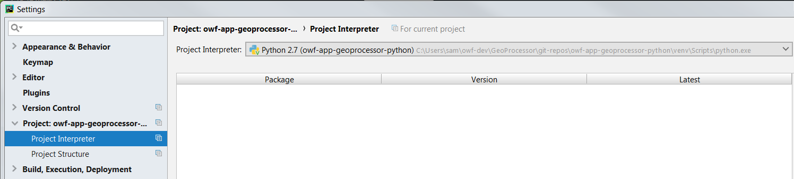
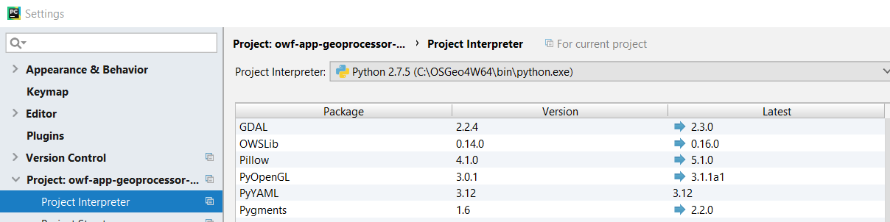
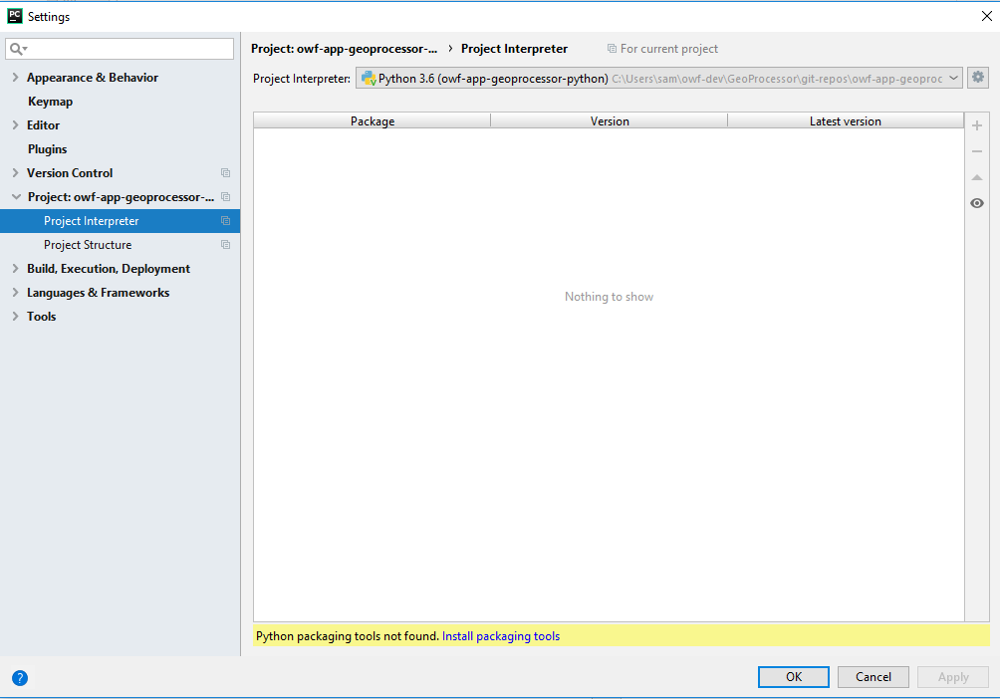
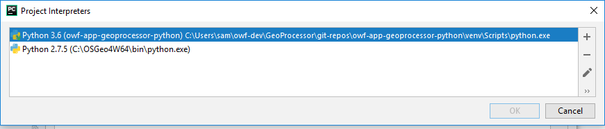
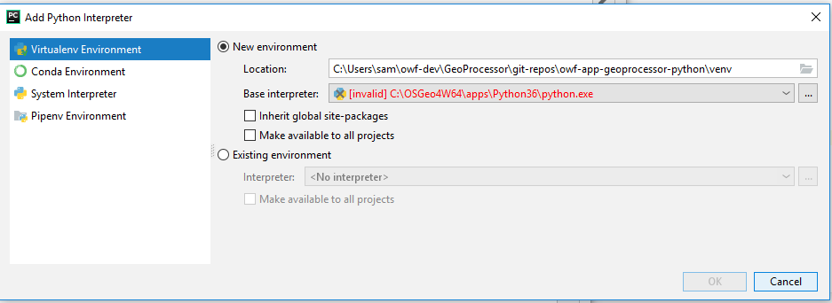
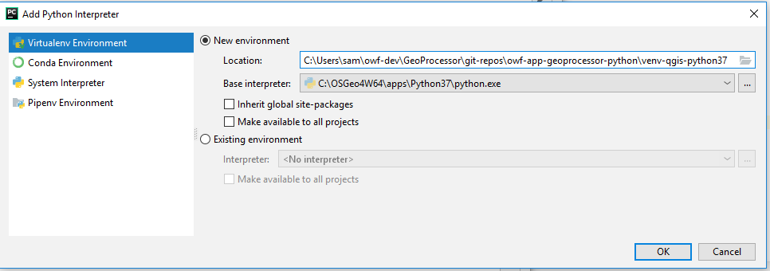
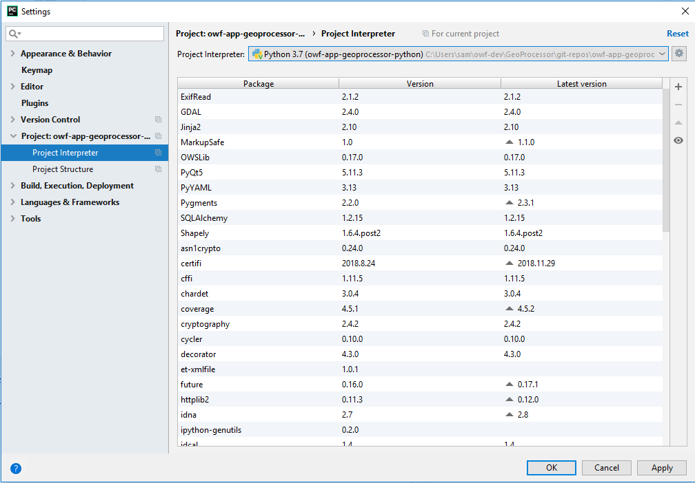

# GeoProcessor / Development Environment / PyCharm #

* [Introduction](#introduction)
* [Alternatives to PyCharm](#alternatives-to-pycharm)
* [Install PyCharm](#install-pycharm)
* [Script to Run PyCharm](#script-to-run-pycharm)
* [Configure PyCharm](#configure-pycharm)
* [Update PyCharm](#update-pycharm)
* [Update PyCharm to use New Python](#update-pycharm-to-use-new-python)

-------------------

## Introduction ##

PyCharm is the Python integrated development environment tool that has been chosen by
the Open Water Foundation for GeoProcessor development.
Other developers may use other tools if they desire but such tools have not been investigated.
The PyCharm Community Edition is adequate for development.
The GitHub repository for the project is used as the PyCharm project folder
and PyCharm project files are ignored using `.gitignore`.
This means that the developer must set up the PyCharm project themselves rather than
relying on PyCharm project files in the repository.
This approach has been chosen because it is the least prescriptive to the developer community
and Python developers are expected to at least know how to set up a project in their development tool of choice.

The PyCharm IDE runs Python in the development environment,
and therefore each project must be configured to know which Python interpreter to use.
PyCharm is typically configured to use a Python version in the virtual environment folder (`venv`) that is
set up when the GeoProcessor Python project is setup, as shown in the following figure.
If a virtual environment is not set up, then the Python that was selected when
the project was set up will be used (such as user's copy of Python).
A virtual environment is recommended in order to better control development environment Python
packages, which helps understand which packages are needed in the deployed system.
The following image illustrates the interpreter installed in a generic `venv` folder,
which is listed in the main `.gitignore` file.



**<p style="text-align: center;">
General Project Python Interpreter (<a href="../images/pycharm-settings-project-interpreter.png">see full-size image</a>)
</p>**

QGIS is distributed with Python for its run-time environment,
rather than using the user's or computer's Python or PyCharm Python.
The QGIS libraries must be made known to PyCharm in order for the GeoProcessor code to
function without errors (see the [Script to Run PyCharm](#script-to-run-pycharm) section).
The PyCharm virtual environment Python (3.x, consistent with QGIS) will be used for development.
The Python environment used for PyCharm can use the QGIS Python if it is specified as the project interpreter, as shown below.
However, the GeoProcessor is typically run in the development environment using the batch file `scripts/gpdev.bat` or `scripts/gpuidev.bat`.
The following image illustrates the interpreter installed in a versioned `venv-qgis-python37` folder for clarity,
which is listed in the main `.gitignore` file.



**<p style="text-align: center;">
QGIS Project Python Interpreter (<a href="../images/pycharm-settings-project-interpreter-qgis.png">see full-size image</a>)
</p>**

The QGIS Python can be used in a deployed environment, as long as the GeoProcessor module (`geoprocessor`) is
installed in QGIS `site-packages` folder or `PYTHONPATH` includes the GeoProcessor module.
Using the QGIS environment as much as possible helps ensure that there are no compatibility issues with the QGIS software,
which is important because much of the GeoProcessor processing is performed with QGIS tools.
The GeoProcessor is normally distributed using a Python virtual environment so that users don't
have to install any Python or other software.
See the [Development Tasks / Creating Installer](../dev-tasks/creating-installer.md) documentation.

To run QGIS software, PyCharm and applications that use QGIS (including the GeoProcessor),
it is best to use a batch file (Windows) or shell script (Linux).
This ensures that the correct version of Python and additional Python modules are properly configured.
This is discussed in the [Script to Run PyCharm](#script-to-run-pycharm) section.

## Alternatives to PyCharm ##

The PyCharm Community Edition is used for GeoProcessor development at the Open Water Foundation.
However, other developers may prefer to use other Python development tools.
Keep the following in mind:

1. This Developer Documentation has been developed assuming that PyCharm is used.
Using other tools would require similar configuration.
2. PyCharm project files are omitted from the repository using the main `.gitignore` file.
Implementing other development environment tools should also take care to omit developer-specific and
dynamic files from the repository.
3. The development environment does not limit using build-in Python tools such as IDLE.
4. Use of alternate tools should continue to follow project standards, such as PEP code formatting.

## Install PyCharm ##

Install the PyCharm 64-bit Community Edition:

* [PyCharm Download page](https://www.jetbrains.com/pycharm/download/#section=windows) - select Windows
* The installer has the option of creating a desktop shortcut.  Do this for 64-bit launcher.
* It is not necessary to associate `.py` files with PyCharm, but also OK to make the association.
* Otherwise, accept the defaults.
* The installer appears to be intelligent enough to carry forward configuration information from previous installations of PyCharm.

This will install PyCharm into a folder similar to `C:\Program Files\JetBrains\PyCharm Community Edition 2018.1.2`
(new versions are released periodically).
Once installed the software may periodically ask to install updates.
Doing so does not appear to change the original install folder (even if the version changes)...updates seem
to install in the same folder.
It may be that an update only creates a new folder for a new year.
See the next section for information about running PyCharm with configuration that uses QGIS Python.

## Script to Run PyCharm ##

As indicated in previous sections, it is necessary to use the QGIS Python and packages in order to use the QGIS functionality.
PyCharm must also use QGIS Python interpreter and packages in order to allow for code inspection and module imports.
Therefore, a batch file or script can be used to configure the environment and run PyCharm.
This script must recognize the install location of PyCharm software, which may be different for each developer.
To start PyCharm, run one of the following scripts, with location shown relative to the project files once
cloned from the repository (explained in the [New Developer](../dev-new/dev-new.md) section):

* Windows (via command prompt window):
	+ [owf-app-geoprocessor-python/build-util/run-pycharm-ce-for-qgis.bat](https://github.com/OpenWaterFoundation/owf-app-geoprocessor-python/blob/master/build-util/run-pycharm-ce-for-qgis.bat) - run
	PyCharm Community Edition installed in the standard location - the most recent PyCharm version found will be run
	+ Other scripts may be added to run other versions of PyCharm or other tools
* Linux (via terminal window):
	+ PyCharm is currently not used in Linux for development but will be tested in the future.

## Configure PyCharm ##

After installing PyCharm, a few additional configuration changes should be made:

1. Change the Python docstring format.
Google docstring format has been selected due to simplicity  To configure,
use the ***File / Settings*** menu, then ***Tools / Python Integrated Tools***.
Then change ***Docstrings / Docstring format:*** to ***Google***.
The ***Analyze Python code in docstrings*** choice should be checked.

## Update PyCharm ##

PyCharm periodically provides a notification in the user interface that an update is available
and provides a link to update and restart the software.
There is generally no reason to postpone updates, so follow the instructions to update.

The update appears to always update files in the previous version regardless of the installation folder.
This may mean that the PyCharm version indicated in ***Help / About*** is not consistent with the installation folder.
This does not seem to be an issue.
The [script to run PyCharm](#script-to-run-pycharm) checks for multiple PyCharm version and runs the latest found installed version.

## Update PyCharm to use New Python ##

It may be necessary to update the Python that is used in PyCharm,
for example if a new version of QGIS is installed.
In this case, a new virtual environment can be created and the project settings updated to use the new virtual environment.
Update the virtual environment as follows.

First start PyCharm for the GeoProcessor.
Then select the project settings in PyCharm with ***File / Settings***.
Then select the ***Project Interpreter*** item, as shown below.



**<p style="text-align: center;">
PyCharm Project Interpreter Configuration (<a href="../images/update-pycharm-python1.png">see full-size image</a>)
</p>**

**Need to evaluate whether the warning shown at the bottom of the above dialog is significant.**
The `C:\OSGeo4W64\apps\Python37` and `C:\OSGeo4W64\apps\bin` folders do not include `pip3` by default.

Click on the gear icon in the upper right and select ***Show All...***, which will display the following.



**<p style="text-align: center;">
Project Interpreter List (<a href="../images/update-pycharm-python2.png">see full-size image</a>)
</p>**

Clicking on the + icon in the upper right will show the following dialog to add a new Python interpreter.
In this case the error is due to QGIS having been updated to version 3.7 and the
`C:\OSGeo4W64\apps\Python36` folder no longer exists.



**<p style="text-align: center;">
Add Python Interpreter (<a href="../images/update-pycharm-python3.png">see full-size image</a>)
</p>**

To create a new virtual environment,
use the ***Base Interpreter ...*** button to select a new QGIS Python, for example select Python37 as shown below.



**<p style="text-align: center;">
Specify Base Python Interpreter (<a href="../images/update-pycharm-python4.png">see full-size image</a>)
</p>**

Press ***OK*** to create the virtual environment in the folder shown above.
This may take a minute or two.
This will only copy the core Python executable programs and files, but not `site-packages` or other third-party packages.
Once the virtual environment is created, it will be listed in available ***Project Interpreters*** as shown in the following figure.


**<p style="text-align: center;">
Project Interpreters After Adding an Interpreter (<a href="../images/update-pycharm-python5.png">see full-size image</a>)
</p>**

Select the new virtual environment and press ***OK***.
The following dialog will be shown showing the installed packages.



**<p style="text-align: center;">
Packages Intalled for an Interpreter (<a href="../images/update-pycharm-python6.png">see full-size image</a>)
</p>**

Press ***OK*** to confirm selection of the new Python virtual environment.
It may take a few minutes for the project to refresh using the new virtual environment.

To confirm which version of Python is running,
run the `geoprocessor/app/printenv.py` script in PyCharm (right click and run).
Output will be similar to the following.
Note that the Python being used is the virtual environment and that the `sys.path`
includes QGIS libraries using old-style 8.3 paths.
The Python path is defined in the `build-util/run-pycharm-ce-for-qgis.bat` file to run in Windows.

```
Python Properties:
    Python executable (.executable): C:\Users\sam\owf-dev\GeoProcessor\git-repos\owf-app-geoprocessor-python\venv-qgis-python37\Scripts\python.exe
    Python Version (sys.version): 3.7.0 (v3.7.0:1bf9cc5093, Jun 27 2018, 04:59:51) [MSC v.1914 64 bit (AMD64)]
    Python Path (sys.path):
        C:\Users\sam\owf-dev\GeoProcessor\git-repos\owf-app-geoprocessor-python
        C:\OSGEO4~2\apps\Python37\lib\site-packages
        C:\OSGEO4~2\apps\qgis\python
        C:\OSGEO4~2\apps\qgis\python\plugins
        C:\Users\sam\owf-dev\GeoProcessor\git-repos\owf-app-geoprocessor-python\venv-qgis-python37\Scripts\python37.zip
        C:\OSGEO4~2\apps\Python37\DLLs
        C:\OSGEO4~2\apps\Python37\lib
        C:\OSGeo4W64\apps\Python37
        C:\Users\sam\owf-dev\GeoProcessor\git-repos\owf-app-geoprocessor-python\venv-qgis-python37
        C:\Users\sam\owf-dev\GeoProcessor\git-repos\owf-app-geoprocessor-python\venv-qgis-python37\lib\site-packages
```

Similar information can be viewed in the GeoProcessor UI using the ***Help / Software/System Information*** menu item.
