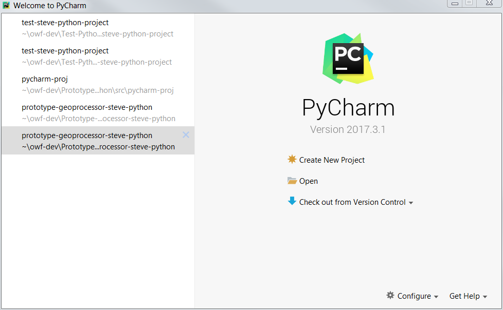
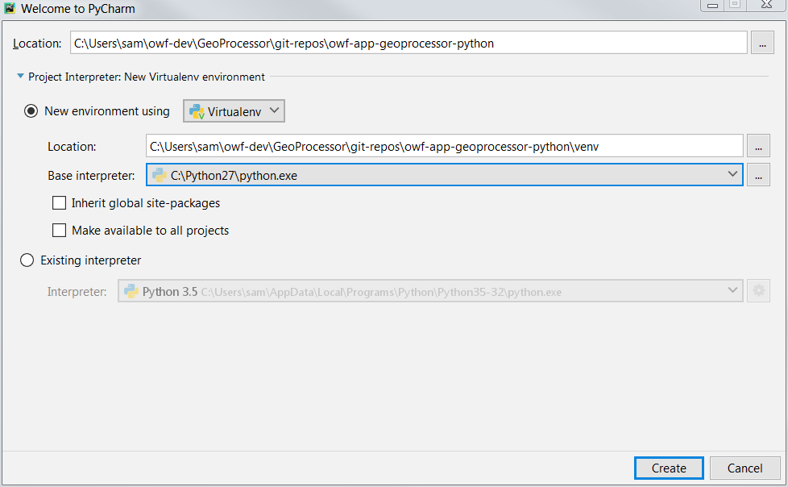
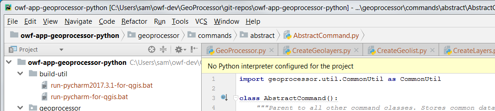
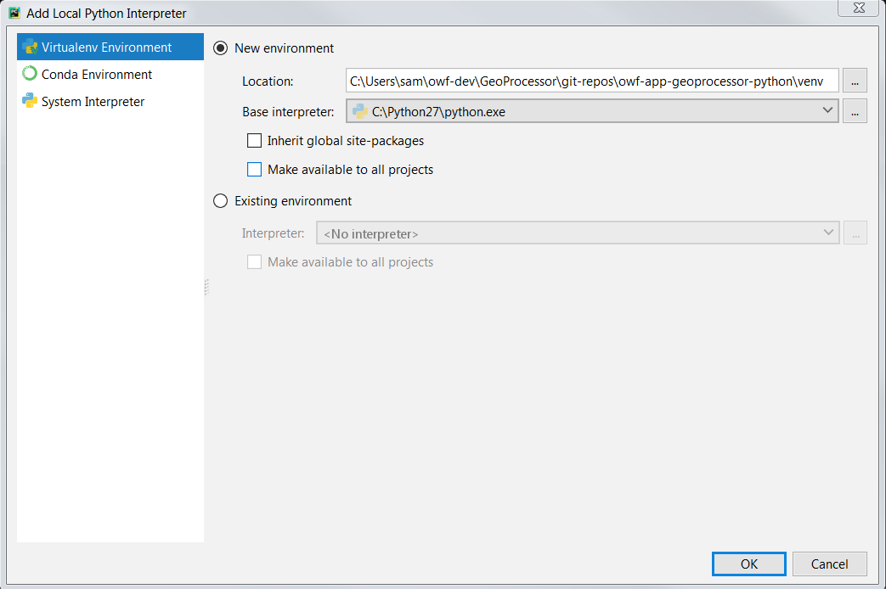

# Learn GeoProcessor (Dev) / New Developer #

This documentation explains how new developers can set up the development environment and
contribute to GeoProcessor software.

1. Install software:
	1. [Python](#install-python)
	2. [QGIS](#install-qgis)
	3. [PyCharm](#install-pycharm)
	4. [MkDocs](#install-mkdocs)
	4. [Git](#install-git)
2. [Clone Repository and Configure Project](#clone-repository-and-configure-project)
3. [Develop software as per Development Tasks](dev-tasks)

-----------------

## Install Python ##

Install at least one version of Python in the default system or user location, if not already installed.
This version of Python will at a minimum be needed for MkDocs, which is used for documentation.
It may also be used for general purposes.
Python 2.7 and latest version 3 are recommended.
Version 2.7 is currently used by PyCharm and the GeoProcessor, as discussed in the following sections.
See the following:

* [Development Environment / Python](dev-env#python)

## Install QGIS ##

Install QGIS, which provides Python packages that are used by the GeoProccessor.
QGIS is distributed with a version of Python 2.7.
The QGIS Python and associated libraries are used by the deployed GeoProcessor
(GeoProcessor modules are installed in the `site-packages` folder of the QGIS distribution).
**TODO need to confirm this approach - the alternative is to install someone else and use `PYTHONPATH` via a batch file or script.**
See the following:

* [Development Environment / QGIS](dev-env#qgis)

## Install PyCharm ##

The PyCharm integrated development environment is used by OWF to develop the GeoProcessor and is recommended for development.
A PyCharm Python virtual environment is recommended for development to isolate from the system/user Python.
The Python virtual environment should use Python 2.7 as its source in order to be compatible with QGIS.
The PyCharm Python virtual environment will be used to run the GeoProcessor in the development environment,
with QGIS libraries added via the `PYTHONPATH` environment variable in the PyCharm run script.
See the following:

* [Development Environment / PyCharm](dev-env#pycharm)

## Install MkDocs ##

MkDocs is used to create user and developer documentation, each as separate static websites.
See the following:

* [Development Environment / MkDocs](dev-env#mkdocs)

## Install Git ##

Git and GitHub are used for version control.
GeoProcessor contributors are expected to have reasonably good Git skills.

See the following:

* [Development Environment / Git](dev-env#git)

## Clone Repository and Configure Project ##

The following steps illustrate how to clone and configure a PyCharm project.
These instructions are consistent with the project
[README](https://github.com/OpenWaterFoundation/owf-app-geoprocessor-python) file.

The GeoProcessor code project is maintained within a single GitHub repository.
Additional repositories are used for user documentation and functional tests.
This allows progress to occur in all areas, while only requiring Python expertise in the code project.

Once set up, scripts within the project will use relative paths or will refer to known absolute paths,
such as the PyCharm installation folder.
The following folder structure is one option for organizing the GeoProcessor project.
Each of the folders under `git-repos` matches the name of a repository on the Open Water Foundation GitHub page.

```text
C:\Users\user\owf-dev\                         Top-level development folder (Windows).
/home/user/owf-dev/                            Top-level development folder (Linux).
/cygdrive/C/Users/user/owf-dev/                Top-level development folder (Cygwin).
  GeoProcessor/                                Product folder.
    git-repos/                                 Git repositories for the GeoProcessor.
      owf-app-geoprocessor-python/             Code repository.
      owf-app-geoprocessor-python-doc-user/    User documentation.
      owf-app-geoprocessor-python-test/        Functional tests.
      owf-util-git/                            Git utility scripts (under development).

```

Therefore, to set up a new project, create a folder down to the `git-repos` level.
Then execute `git clone` for each of the component repositories.

### Start PyCharm ###

Once cloned, the following script can be used to start PyCharm on Windows, or use a similar approach.
The script configures the Python environment to find QGIS libraries, which are needed by the GeoProcessor.

```text
git-repos/owf-app-geoprocessor-python/build-util/run-pycharm2017.3.1-for-qgis.bat
```
For example, open a Windows command prompt window, change to the folder shown above,
and then run the batch file to start PyCharm.

### Configure New Project ###

Once PyCharm is started, a new project can be configured.
This will rely on a Python virtual environment.



Select ***Create New Project***.
Then select the folder that was cloned from GitHub, similar to the following.
Note that the repository's `.gitignore` file indicates to ignore all PyCharm project files.
The user documentation and functional test repositories do not need to be known to PyCharm.



PyCharm may display a warning:


Press ***Yes***.
The project will be created/imported and the main PyCharm interface will be shown, with project files listed,
as shown in the following image.
Note that the project name in the upper left of the file listing matches the Git repository name.
Note also that PyCharm warns about no interpreter being defined.



To add an interpreter, use the ***File / Settings*** menu and then ***Project: owf-app-geoprocessor-python / Project Interpreter***.
Indicate that a new environment should be used, which will create a virtual environment as shown in the following image.
Select a base interpreter that is Python 2.7, since that is what will be used in the deployed environment.
**The QGIS Python distribution is not a standard Python distribution folder structure so don't use it for the base interpreter.**
Pressing ***OK*** will copy needed files from the base interpreter to the virtual environment.



The environment is then ready for development.  Use the PyCharm startup script each time that PyCharm needs to be started for development.
