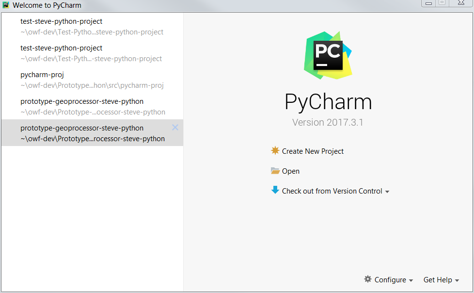
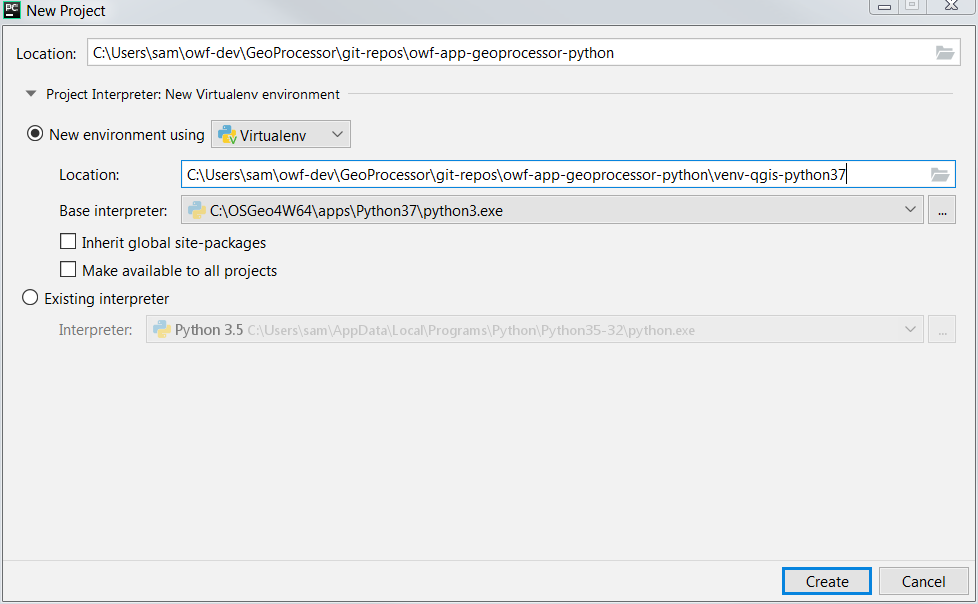
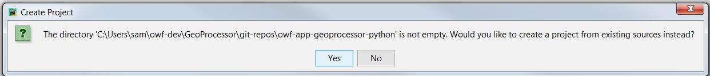
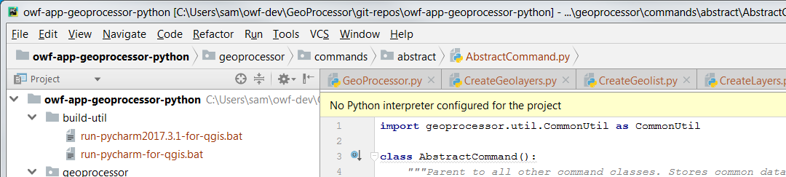
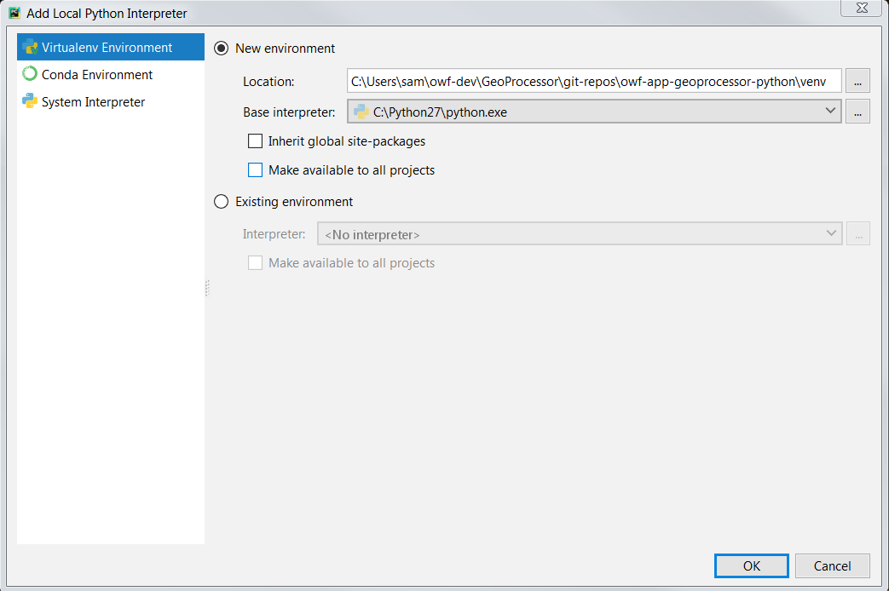

# GeoProcessor / New Developer #

This documentation explains how new developers can set up the development environment for the GeoProcessor software.
The development environment should be set up for each of the following software components.
Discussion of tool updates is included in the development environment page for each tool.

1. [Create Folders for Development](#create-folders-for-development)
2. Install software:
	1. [Python](#install-python)
	2. [QGIS](#install-qgis)
	3. [PyCharm](#install-pycharm)
	4. [MkDocs](#install-mkdocs)
	5. [Git](#install-git)
	6. [Cygwin](#install-cygwin)
3. [Clone Repository and Configure Project](#clone-repository-and-configure-project)
4. [Run the GeoProcessor](#run-the-geoprocessor)
5. [Develop software as per Development Tasks](#develop-software-as-per-development-tasks)

-----------------

## Create Folders for Development ##

Folders need to be created to hold the GeoProcessor development files.
Instructions are provided for each step that folders need to be created.
The [Clone Repository and Configure Project](#clone-repository-and-configure-project)
step describes creating folders.

See the following:

* [Development Environment Folders](../dev-env/folders.md)

## Install Python ##

Multiple versions of Python need to be installed, if not already installed.
Python versions are used as follows:

* Python 3.7 (or similar, depending on QGIS version)
installed with QGIS will be used to initialize the Pycharm virtual environment
to edit code and run the GeoProcessor in PyCharm.
It may also be used to initialize the virtual environment for deployment;
however, the QGIS Python environment is a bit nonstandard and therefore a normal Python install
is recommended for creating the Python virtual environment for testing framework deployment (see below).
* Python 3.7 (or similar, depending on QGIS version) is used to create a virtual environment
for the GeoProcessor testing framework, independent of QGIS Python version.
* Python 2 or 3 is used by MkDocs to process Markdown documentation into static websites (can use the above version).

See the following:

* [Development Environment / Python](../dev-env/python.md)

## Install QGIS ##

Install QGIS, which provides Python packages that are used by the GeoProccessor.
QGIS is distributed with a version of Python 3.
The QGIS Python and associated libraries are used by the deployed GeoProcessor.
GeoProcessor modules are installed in the `site-packages` folder of the GeoProcessor virtual environment and
are made known to the QGIS Python at runtime.
See the following:

* [Development Environment / QGIS](../dev-env/qgis.md)

## Install PyCharm ##

The PyCharm integrated development environment is used by OWF to develop the GeoProcessor and is recommended for development.
A PyCharm Python virtual environment is recommended for development to isolate from the system/user Python.
The Python virtual environment should use Python 3.x consistent with QGIS and as the base interpreter for the
PyCharm virtual environment.
The PyCharm Python virtual environment will be used to run the GeoProcessor in the development environment,
with QGIS libraries added via the `PYTHONPATH` environment variable in the PyCharm run script and `scripts` run scripts.
See the following:

* [Development Environment / PyCharm](../dev-env/pycharm.md)

## Install MkDocs ##

MkDocs is used to create user and developer documentation, each as separate static websites.
See the following:

* [Development Environment / MkDocs](../dev-env/mkdocs.md)

## Install Git ##

Git and GitHub are used for version control.
GeoProcessor contributors are expected to have reasonably good Git skills.

See the following:

* [Development Environment / Git](../dev-env/git.md)

## Install Cygwin ##

Cygwin provides a Linux-like environment on Windows that can be used to run the GeoProcessor testing framework.
A Cygwin-compatible Python virtual environment is created.
See the following:

* [Development Environment / Cygwin](../dev-env/cygwin.md)

## Clone Repository and Configure Project ##

The following steps illustrate how to clone and configure a PyCharm project.
These instructions are consistent with the project
[README](https://github.com/OpenWaterFoundation/owf-app-geoprocessor-python) file.

The GeoProcessor code project is maintained within a single GitHub repository.
Additional repositories are used for user documentation and functional tests.
This allows progress to occur in all areas, while only requiring Python expertise in the code project.

Once set up, scripts within the project will determine the folder for the script and
use paths relative to the script folder.
by determining the folder that a script is run in and appending to that path.
The following folder structure is the recommended folder structure for organizing the GeoProcessor project.
Each of the folders under `git-repos` matches the name of a GitHub repository.

```text
C:\Users\user\owf-dev\                         Top-level development folder (Windows).
/home/user/owf-dev/                            Top-level development folder (Linux).
/cygdrive/C/Users/user/owf-dev/                Top-level development folder (Cygwin).
  GeoProcessor or GP/                          Product folder (see note below).
    git-repos/                                 Git repositories for the GeoProcessor.
      owf-app-geoprocessor-arcpy/              Code repository for ArcGIS version (only if developing ArcGIS version).
      owf-app-geoprocessor-python/             Code repository.
      owf-app-geoprocessor-python-doc-user/    User documentation.
      owf-app-geoprocessor-python-test/        Functional tests.
      owf-util-git/                            Git utility scripts (under development).

```

To set up a new project:

1. Create a folder inclusive of the `git-repos` level.
**The virtual environment folder in the developer environment involves `hashbang` (`#!`)
paths that are limited to 127 characters.  If this limit is exceeded, use a shorter product-level
folder indicated above, such as `GP` rather than `GeoProcessor`.**
2. Clone the main component repository into `git-repos`: `owf-app-geoprocessor-python`.
3. Run the `build-util/git-clone-all-gp.sh` script to clone the other repositories (if they don't already exist).

The `owf-app-geoprocessor-arcpy` project relies on Esri's ArcGIS Pro and is not needed for the QGIS GeoProcessor.
Additional information will be added later for the ArcGIS Pro version of the GeoProcessor.

### Start PyCharm ###

Once cloned, the following script can be used to start PyCharm Community Edition on Windows, or use a similar approach.
The script configures the Python environment to find QGIS libraries, which are needed by the GeoProcessor.
Other versions of this script may also be added over time.

```text
git-repos/owf-app-geoprocessor-python/build-util/run-pycharm-ce-for-qgis.bat
```

The script will detect the latest version of PyCharm that is installed.
This approach ensures that basic development environment configuration is as expected.

### Configure New Project ###

Once PyCharm is started, a new project can be configured.
This will rely on a Python virtual environment.



**<p style="text-align: center;">
PyCharm Startup Screen (<a href="../images/create-project1.png">see full-size image</a>)
</p>**

Select ***Create New Project*** (can also use ***File / New Project...*** if initial screen is not available).
Then select the folder that was cloned from GitHub, similar to the following.
Note that the `owf-app-geoprocessor-python` repository's `.gitignore` file indicates to ignore all PyCharm project files.
The user documentation and functional test repositories do not need to be known to PyCharm;
therefore, only the `owf-app-geoprocessor-python` repository needs to be known to PyCharm.
The QGIS Python version to be used for the base interpreter can be determined by checking folder names in the `C:\OSGeo4W64\apps` folder,
which will use `Python3x` for recent release and may include `Python27` for the long-term stable release if installed. 
For example, use the `Python37` version or later, based on what is distributed with OSGeo4W QGIS.



**<p style="text-align: center;">
Specify Python Interpreter for the Project (<a href="../images/create-project2.png">see full-size image</a>)
</p>**

PyCharm may display a warning because a new project is being created in a folder that contains existing files:



**<p style="text-align: center;">
New Project Warning for Existing Files (<a href="../images/create-project3.png">see full-size image</a>)
</p>**

Press ***Yes*** because the files from the cloned Git repository will be used for the project.
The project will be created/imported and the main PyCharm interface will be shown, with project files listed,
as shown in the following image.
Note that the project name in the upper left of the file listing matches the Git repository name.

If a warning is shown about no interpreter being configured as in the following figure,
an interpreter can be added as described below.



**<p style="text-align: center;">
New Project after Git Repository Files are Imported (<a href="../images/create-project4.png">see full-size image</a>)
</p>**

To add an interpreter, use the ***File / Settings*** menu and then ***Project: owf-app-geoprocessor-python / Project Interpreter***.
Indicate that a new environment should be used, which will create a virtual environment as shown in the following image.
Select the base interpreter from the QGIS Python distribution to
ensure consistency between the development environment and the GeoProcessor that will be deployed.
The [script that is used to run Python for GeoProcessor development](../dev-env/pycharm.md#script-to-run-pycharm)
configures the environment to ensure that necessary Python packages and QGIS software are found.



**<p style="text-align: center;">
Specifying the Python Interpreter (<a href="../images/create-project5.png">see full-size image</a>)
</p>**

Pressing ***OK*** will copy needed files from the base interpreter to the virtual environment.
The environment is then ready for development.
Use the [PyCharm run script](../dev-env/pycharm.md#script-to-run-pycharm)
each time that PyCharm needs to be started for development.

## Run the GeoProcessor ##

See the [Development Environment / Running the GeoProcessor documentation](../dev-env/running.md)
for information on running the GeoProcessor in the development environment.

## Develop software as per Development Tasks ##

Once the development environment is set up, various development tasks can be performed
as per the [Development Tasks documentation](../dev-tasks/overview.md).
