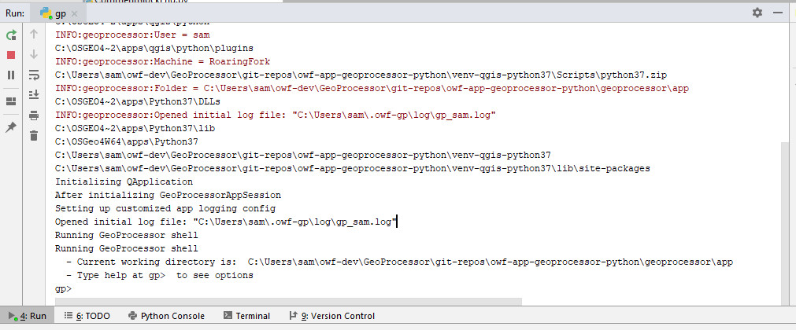

# GeoProcessor / Development Tasks / Running #

The GeoProcessor can be run in the development environment in several ways.

* [Run Using Dev Scripts](#run-using-dev-scripts)
* [Run in Virtual Environment](#run-in-virtual-environment)
* [Run the Installer and Run the GeoProcessor](#run-the-installer-and-run-the-geoprocessor)
* [Run in PyCharm](#run-in-pycharm)

------------------

## Run Using Dev Scripts ##

This approach is the most efficient way to run the GeoProcessor in the developer environment
because the original source files are used directly.

The GeoProcessor can be run in the development environment by running the following batch files in a Windows command shell window.

* `scripts/gpdev.bat` - run command file in batch mode, for example for automated tests
* `scripts/gpdevui.bat` - start the GeoProcessor UI

The `gpdevui.bat` batch file calls the `gpdev.bat` file with `--ui` option, which is passed to the Python `gp.py` script.
Use the `/h` option to see the usage of the scripts.
The batch files configure the command shell the first time they are run and then the window can be used to re-run the batch files.
For example, environment variables that use a path are configure the first time
so that the path does not get longer and longer each time the script is run.

The title of the window is changed to indicate its use, to avoid confusion with other windows that may be opened.

## Run in Virtual Environment ##

This approach is necessary to run the GeoProcessor in an environment that matches the deployed environment.
It is also necessary to run the testing framework that does not have QGIS dependencies.
The testing framework is designed for deployment on Cygwin and Linux to help automate software tests.
Its features are also available in the full GeoProcessor/QGIS version.

To run the testing framework:

1. Run the `1` and `2` scripts as described in the
[Creating Installer section](creating-installer.md),
which will create an appropriate virtual environment for the operating system and GeoProcessor version.
2. Change to the appropriate folder such as `venv-tmp/gptest-1.1.0-cyg-venv/scripts` for CygWin.
Separate virtual environments are created for full GeoProcessor (`gp`) and testing framework (`gptest`)
variants of the GeoProcessor.
3. Run the appropriate script:
	1. `gp` or `gp.bat` to run the full GeoProcessor in batch mode.
	2. `gpui` or `gpui.bat` to run the full GeoProcessor in user interface mode.
	3. `gptest` or `gptest.bat` to run the testing framework in batch mode.
	4. `gptestui` or `gptestui.bat` to run the testing framework in user interface mode.

## Run the Installer and Run the GeoProcessor ##

To fully test the GeoProcessor, download and install the GeoProcessor software, and then run in the deployed environment.
See the [GeoProcessor Downloads page](http://software.openwaterfoundation.org/geoprocessor/).

It is also possible to run the `scripts/install-gp.sh` script in Cygwin or Linux to
install local `tar.gz` and `zip` file installer.
The `install-gp.sh` script will prompt for the installer file and destination filder.

## Run in PyCharm ##

This approach can be used in some cases but is not generally the main way to run the GeoProcessor.

The GeoProcessor can be run from within the PyCharm IDE.
For example, right click on the `geoprocessor/app/gp.py` file in the ***Project*** view
and select ***Run 'gp'***.
However, the default run mode is to start the interactive interpreter,
which may not be the most desirable way to start the GeoProcessor.
The following image illustrates the GeoProcessor interpreter that is accessible in the PyCharm ***Run*** tab.

**

GeoProcessor Running in PyCharm (<a href="../images/running-in-pycharm.png">see full-size image</a>)

**

The PyCharm ***Run*** tab can be used to enter GeoProcessor interpreter commands such as `ui` to start the user interface.

Running in Python may be better suited for tasks such as using the debugger.

