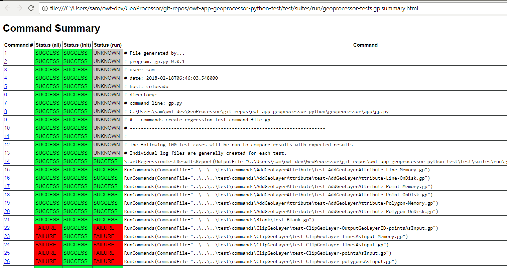

# GeoProcessor / Development Tasks / Testing #

The GeoProcessor is designed to facilitate automated testing.
Each command file and suites of command files can be tested.

* [Introduction](#introduction)
* [Unit Tests](#unit-tests)
* [Functional Tests](#functional-tests)
	+ [Run Individual Test in UI](#run-individual-test-in-ui)
	+ [Run Test Suite in UI](#run-test-suite-in-ui)
	+ [Run Test Suite in Batch Mode](#run-test-suite-in-batch-mode)

--------------------

## Unit Tests ##

The GeoProcessor does not currently utilize unit tests such a pytest.
However, units tests will be added in the future.
The majority of testing currently uses the functional test framework in order to test full functionality and user experience.

## Functional Tests ##

Functional tests run the GeoProcessor software in the development or installed (deployed) environment and
test the internal code, environment, operational tools, and workflow.
Anything that breaks in the technology stack or test configuration will result in a test failure,
which effectively implements tests at a larger scope than code unit tests.
The GeoProcessor testing framework can also be used to test other software,
for example by using
[`RunProgram`](http://learn.openwaterfoundation.org/owf-app-geoprocessor-python-doc-user/command-ref/RunProgram/RunProgram/)
commands.

Functional tests are saved in the
[owf-app-geoprocessor-python-test functional testing repository](https://github.com/OpenWaterFoundation/owf-app-geoprocessor-python-test)
repository.
Functional tests are maintained in a separate repository because contributions may be submitted by non-programmers,
and to limit the size of the code repository.

Functional tests stored in the above repository are generally run one of following ways:

### Run Individual Test in UI ###

Individual tests are run in the UI similar to running any command file.
Test command files are available in the repository for each command:
[`owf-app-geoprocessor-python-test/test/commands`](https://github.com/OpenWaterFoundation/owf-app-geoprocessor-python-test/tree/master/test/commands).

The tests should be created and run to ensure that software functionality is as expected.
An example test command file is:

```
StartLog(LogFile="results/test-CopyGeoLayer-Line.gp.log")
# Test copying a GeoLayer 
# - data is a GeoJSON line layer
# Remove the result line geojson file from the last run of the test, if existing
RemoveFile(SourceFile="results/test-CopyGeoLayer-Line-out.geojson", IfSourceFileNotFound="Ignore")
# Read the line GeoJSON (with GeoLayerID of "line") into the GeoProcessor 
ReadGeoLayerFromGeoJSON(SpatialDataFile="data/line.geojson", GeoLayerID="line")
# Copy the GeoLayer 
CopyGeoLayer(GeoLayerID="line")
# Uncomment the line below to recreate the expected results
#WriteGeoLayerToGeoJSON(GeoLayerID="line_copy", OutputFile="expected-results/test-CopyGeoLayer-Line-out")
# Write the copied Geolayer to a GeoJSON file 
WriteGeoLayerToGeoJSON(GeoLayerID="line_copy", OutputFile="results/test-CopyGeoLayer-Line-out")
# Compare the results to the expected results
CompareFiles(InputFile1="expected-results/test-CopyGeoLayer-Line-out.geojson", InputFile2="results/test-CopyGeoLayer-Line-out.geojson",IfDifferent="Warn")
```

Guidelines for tests are:

1. Name test command files similar to `test-CommandName-specifics.gp`, with `specifics` being a sequence of dash-separated words that describes the test.
2. Each command file should test one or a small number of features.
3. Folders involved in each command's tests include:
	1. `data` - use for static data needed as input to the tests.
	If appropriate, create command files in the `data` folder to create the static data, to record how data files were created.
	2. `expected-results` - the expected results, which are verified and committed to the repository
	3. `results` - the results generated each time the command file is run, not committed to the repository.
	A `.gitignore` file should be created in each `results` folder to ignore all files in the folder except the `.gitignore` file.
3. The sequence of each command file should be:
	1. Start a log file using `StartLog` command.  The name of the log file should be the name of the command file with `.log`
	and should be written to the `results` folder.
	2. Comment(s) explaining the test(s).
	3. Remove any test results using the `RemoveFile` command.
	This ensures that if the software fails unexpectedly, the old results will not have been produced as a false positive test result.
	4. Execute commands that comprise the test, for example run the command being tested with a specific combination of parameters.
	5. Write results to the `expected-results` folder in a format that allows comparison (may skip if the comparison can be done in memory).
	For example, write a GeoLayer to a GeoJSON file.
	This command will be commented out once expected results are verified.  Expected results should be committed to the repository.
	The name of output files should be the same as the command file with `-out` at end and instead of `gp` use a file extension that is appropriate,
	for example `.geojson` for GeoJSON file.
	6. Write the results again, to the `results` folder.  These results will be created each time the test is run and should not
	be committed to the repository.
	7. Compare the `results` with `expected-results` files using an appropriate comparison command, for example `CompareFiles`.
	Such a command will evaluate whether the test passes or fails.

If a test fails, review the command status and log file and determine whether the issue is input, command parameters, or software issue.
Resolve the issue as necessary to make he test pass.
It is also appropriate to create tests that purposefully fail, and test to make sure that it happens.

### Run Test Suite in UI ###

The individual tests can be organized into test suites in order to efficiently run many tests.
It is envisioned that additional features will be enabled in the GeoProcessor to control how test suites are formed
but currently the approach is simple and relies on matching command files starting with `test-` and ending with `.gp`.
For example, in the future, options will be provided to filter the commands that are included in a suite.

To create and run the test suite:

1. **Create test suite command file** - Use the UI to open the command file
[`test/suites/create/create-regression-test-command-file.gp`](https://github.com/OpenWaterFoundation/owf-app-geoprocessor-python-test/blob/master/test/suites/create/create-regression-test-command-file.gp).
This runs the `CreateRegressionTestCommandFile` command, which walks the folder containing command tests
and creates a single command file with `RunCommands` commands.
Each `RunCommands` command will run one command file.
2. **Run the test suite command file** - Use the UI to open the command file created from the above:  `test/suites/run/geoprocessor-tests.gp` and run the commands.
3. **Review test results**:
	1. Review the log file created by the previous step and command files that were run
	(from `StartLog` commands used in tests).
	2. Review the test summary file (`geoprocessor-tests-out.gp.txt`) that was generated by the test suite command file.
	This has one line per test indicating whether the test passed, and a summary at the bottom.
	Use a text editor to search for failures.
	See the example below.
	3. Review the command summary file (`geoprocessor-tests.gp.summary.html`) that was generated by the test suite command file
	This file contains a summary of all command log messages in a color-coded HTML file,
	which provide specifics for failed tests.
	View the file in a web browser.
	See the example below.
	4. Fix issues in the software and test and run again.

The following example illustrates the test suite command file:

```text
# File generated by...
# program:      gp.py 0.0.1
# user:         sam
# date:         2018-01-30T01:33:40.672000
# host:         colorado
# directory:    
# command line: gp.py
#  C:\Users\sam\owf-dev\GeoProcessor\git-repos\owf-app-geoprocessor-python\geoprocessor\app\gp.py
# #             --commands create-regression-test-command-file.gp
# -----------------------------------------------------------------------
#
# The following 68 test cases will be run to compare results with expected results.
# Individual log files are generally created for each test.
StartRegressionTestResultsReport(OutputFile="C:\Users\sam\owf-dev\GeoProcessor\git-repos\owf-app-geoprocessor-python-test\test\suites\run\geoprocessor-tests.gp.out.txt")
RunCommands(CommandFile="..\..\..\test\commands\AddGeoLayerAttribute\test-AddGeoLayerAttribute-Line-Memory.gp")
...other similar commands...
WriteCommandSummaryToFile(OutputFile="C:\Users\sam\owf-dev\GeoProcessor\git-repos\owf-app-geoprocessor-python-test\test\suites\run\geoprocessor-tests.gp.summary.html")
```

The following is an example of the `geoprocessor-tests-out.gp.txt` file with test results, which is dynamically-created and is not committed to the repository:

```text
# File generated by...
# program:      gp.py 0.0.1
# user:         sam
# date:         2018-02-18T06:47:05.871000
# host:         colorado
# directory:    
# command line: gp.py
# 
# #             C:\Users\sam\owf-dev\GeoProcessor\git-repos\owf-app-geoprocessor-python\geoprocessor\app\gp.py
# #             --commands geoprocessor-tests.gp
# -----------------------------------------------------------------------
#
# Command file regression test report from StartRegressionTestResultsReport() and RunCommands()
#
# Explanation of columns:
#
# Num: count of the tests
# Enabled: TRUE if test enabled or FALSE if "#@enabled false" in command file
# Run Time: run time in milliseconds
# Test Pass/Fail:
#    The test status below may be PASS or FAIL (or blank if disabled).
#    A test will pass if the command file actual status matches the expected status.
#    Disabled tests are not run and do not count as PASS or FAIL.
#    Search for *FAIL* to find failed tests.
# Commands Expected Status:
#    Default is assumed to be SUCCESS.
#    "#@expectedStatus Warning|Failure" comment in command file overrides default.
# Commands Actual Status:
#    The most severe status (Success|Warning|Failure) for each command file.
#
#    |       |Test  |Command   |Command    |
#    |       |Pass/ |Expected  |Actual     |
# Num|Enabled|Fail  |Status    |Status     |Command File
#----+-------+------+----------+-----------+---------------------------------------------------------------------------------------------
00001|TRUE   | PASS |SUCCESS   |SUCCESS    |C:\Users\sam\owf-dev\GeoProcessor\git-repos\owf-app-geoprocessor-python-test\test\commands\AddGeoLayerAttribute\test-AddGeoLayerAttribute-Line-Memory.gp
00002|TRUE   | PASS |SUCCESS   |SUCCESS    |C:\Users\sam\owf-dev\GeoProcessor\git-repos\owf-app-geoprocessor-python-test\test\commands\AddGeoLayerAttribute\test-AddGeoLayerAttribute-Line-OnDisk.gp
00003|TRUE   | PASS |SUCCESS   |SUCCESS    |C:\Users\sam\owf-dev\GeoProcessor\git-repos\owf-app-geoprocessor-python-test\test\commands\AddGeoLayerAttribute\test-AddGeoLayerAttribute-Point-Memory.gp
00004|TRUE   | PASS |SUCCESS   |SUCCESS    |C:\Users\sam\owf-dev\GeoProcessor\git-repos\owf-app-geoprocessor-python-test\test\commands\AddGeoLayerAttribute\test-AddGeoLayerAttribute-Point-OnDisk.gp
...
...
#----+-------+-------+------+----------+-----------+---------------------------------------------------------------------------------------------
FAIL count     = 21, 21.000%
PASS count     = 78, 78.000%
Disabled count = 1, 1.000%
#--------------------------------
Total          = 100
#----+-------+-------+------+----------+-----------+---------------------------------------------------------------------------------------------
FAIL count     = 21, 21.000%
PASS count     = 78, 78.000%
Disabled count = 1, 1.000%
#--------------------------------
Total          = 100
```

The following is an example of the `geoprocessor-tests.gp.summary.html` file
containing a summary of test results in HTML format,
which is dynamically-created and is not saved in the repository:



**<p style="text-align: center;">
Test Results Summary as HTML (<a href="../images/geoprocessor-tests.gp.summary.html.png">see full-size image</a>)
</p>**

### Run Test Suite in Batch Mode ###

The same test suite command file that is run in the UI can be run in batch mode.
This can be used to automate tests and implement continuous integration.
The approach of testing using the UI is often used because of its convenience.
