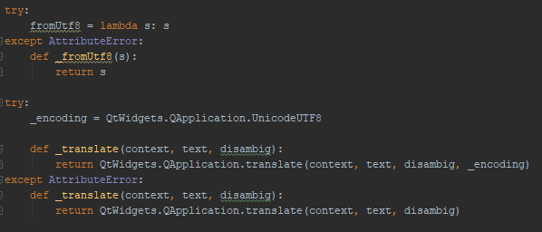

# GeoProcessor / User Interface (UI) Design #

**This documentation needs to be fully reviewed and updated.**

* [Overview](#overview)
* [User Interface Terms](#user-interface-terms)
* [Package Structure](#package-structure)
* Main UI:
	+ The [GeoProcessorUI Class](#geoprocessorui-class) - the main UI class
	+ The [CommandListWidget Class](#commandlistwidget-class) - widget class to display and manage commands
	+ The [GeoProcessorCommandEditorFactory Class](#geoprocessorcommandeditorfactory-class) - widget class to display and manage commands
* Command Editor UI:
	+ The [AbstractCommandEditor Class](#abstractcommandeditor-class) - parent class for all command editors
	+ The [GenericCommandEditor Class](#genericcommandeditor-class) - default command editor
	+ The [SimpleCommandEditor Class](#simplecommandeditor-class) - simple one panel editor
	+ The [TabbedCommandEditor Class](#tabbedcommandeditor-class) - tabbed panel editor
	+ [`Command` Class Input Metadata](#command-class-input-metadata) - configuring command editors
* Utility Modules:
	+ to be added
* [Resources](#resources)

------------------

## Overview

This documentation explains the current user interface design. 
To the main actions of the UI are used as follows

1. Start the GeoProcessor user interface using an instance of `GeoProcessorUI` class.
2. Use the ***File / Open Command File*** menu to open a command file.
3. The command file will appear in the ***Command List***, implemented using the `CommandListWidget` class. 
Each line of the command file is a unique line in the `command list` ui component
4. Click the ***Run Commands*** button. 
The GeoProcessor instance used by the UI will run the commands.
5. Right click on a command in the command list and select ***Edit Command*** to edit a command.

The user interface is implemented by the following classes and modules, listed in order of general to specific,
with sections below to provide more details.

1. Main UI
	1. The [`GeoProcessorUI` class](#geoprocessorui-class)
		* creates the main window user interface
		* controls the actions that take place on the main window
	2. The [`CommandListWidget` class](#commandlistwidget-class)
		* is the visual component of MVC pattern that displays the list of commands
		* has an instance of `GeoProcessorListModel`, which is the model part of MVC pattern and has an instance of `GeoProcessor`
	3. The [`GeoProcessorCommandEditorFactory` class](#geoprocessorcommandeditorfactory-class)
		* determines which instance of command editor to create from command
2. Command Editor
	1. The [`AbstractCommandEditor` class](#the-abstractcommandeditor-class)
		* parent class to all command editor classes 
		* creates the features of the `command dialog` windows that are consistent across all `command dialog` windows 
		* controls the actions that take place consistently across all `command dialog` windows 
	2. The [`GenericCommandEditor` class](#genericcommandeditor-class)
		* command class `command_metatdata['EditorType']'='Generic'` or is not specifies and defaults to this editor
		* child class to the AbstractCommandEditor class
		* instantiates editor UI components in one panel (no tabs)
		* layout is simple list of parameter and corresponding value using text fields
	3. The [`SimpleCommandEditor` class](#simplecommandeditor-class)
		* command class `command_metatdata['EditorType']'='Simple'`
		* child class to the AbstractCommandEditor class
		* instantiates editor UI components in one panel (no tabs)
		* layout is controlled by `parameter_input_metatdata` in each command class
	4. The [`TabbedCommandEditor` class](#tabbedcommandeditor-class)
		* command class `command_metatdata['EditorType']'='Tabbed'`
		* child class to the AbstractCommandEditor class
		* instantiates editor UI components in a tabbed panel
		* layout is controlled by `parameter_input_metatdata` in each command class
3. UI utility classes:
	1. The [`ui_util`](#ui_util)
		* does not currently exist?  Where is reusable UI code?

## User Interface Terms

|Term|Definition|Image|
|-|-|-|
|Main Window|The GeoProcessor's home window. All functionality within the GeoProcessor user interface can be accessed via this window. The `main` window is the first window to appear when the GeoProcessor is started in *ui* mode.|<a href = "images/main_window.png"></a>|
|Command Editor Window|The user interface window that allows the user to create a new command or edit an existing command. There is one `command editor` window for each GeoProcessor command. The command editor window has input fields used to enter the values for the command parameters.| <a href = "images/command_dialog_window.png"></a>|
|Command List UI Component|A subset of the GeoProcessor main window that holds the commands of the command file. There is one line within the `command list` ui component for each command of the command file.|<a href = "images/command_list_ui_component.png"></a>|

## Package Structure ##

The following illustrates teh organization of UI-related classes and modules.

```
geoprocessor/
  ui/                                   Contains all files relating to the UI. 
   app/                                 Contains all files relating to the UI main window.
     CommandListWidget.py               Widget to display and interact with the command list.
     GeoProcessorUI.py                  The main UI.
     GeoProcessorUI_Design.py           Used to prototype with UI components using the UI Designer software,
                                        not used in the application.
   commands/                            Contains all files relating to the GeoProcessor command editors.
     abstract/                          Contains all files relating to the abstract (general) command editors.
       AbstractCommandEditor.py         Parent class for all command editors.
       GenericCommandEditor.py          Default command editor that uses Parameter: Value layout.
       SimpleCommandEditor.py           Command editor that uses simple layout.
       TabbedCommandEditor.py           Command editor that uses tabbed layout.
     commands/                          Specific command editors, when above editors do not suffice.
        datastores/
        layers/
        logging/
        running/
        tables/
        testing/
        util/
          InsertLineEditor.py           Simple single-line editor, such as for comment block start and stop commands.
          InsertLineRulerEditor.py      Editory for multi-line comments.
     util/
        command_parameter.py            Useful functions for parsing and processing commands.
```

## `GeoProcessorUI` Class ##

The `geoprocessor/ui/app/GeoProcesssorUI` class...

**Need to update...**

The second is the `GeoProcessorUI.py` script.
This script is responsible for all of the actions and listeners that occur in the main window user interface.
This script also holds global variables that describes the current state of the GeoProcessor instance
(the number of commands in the [Command List UI Component](images/command_list_ui_component.png), the number of selected commands, etc.).
Lastly, this script interacts with the GeoProcessor object to run the commands and read the results of a processed command file. 
Any actions that take place in the main window should be configured in this script. 
For example, there is a function within the `GeoProcessorUI` class that clears all of the commands in the 
[Command List UI Component](images/command_list_ui_component.png) when the `Clear Commands` button is clicked.

## `CommandListWidget` Class ##

**Need to describe...**

## `GeoProcessorCommandEditorFactory` Class ##

**Need to describe...**

## `AbstractCommandEditor` Class

The `AbstractCommandEditor` class is the parent class to all GeoProcessor command editors.

**Need to describe...**

### Imports 

|Import Statement&nbsp;&nbsp;&nbsp;&nbsp;&nbsp;&nbsp;&nbsp;&nbsp;&nbsp;&nbsp;&nbsp;&nbsp;&nbsp;&nbsp;&nbsp;&nbsp;&nbsp;&nbsp;&nbsp;&nbsp;&nbsp;&nbsp;&nbsp;&nbsp;&nbsp;&nbsp;&nbsp;&nbsp;&nbsp;&nbsp;&nbsp;&nbsp;&nbsp;&nbsp;&nbsp;&nbsp;&nbsp;&nbsp;&nbsp;&nbsp;&nbsp;&nbsp;&nbsp;&nbsp;&nbsp;&nbsp;&nbsp;&nbsp;&nbsp;&nbsp;&nbsp;&nbsp;&nbsp;&nbsp;&nbsp;&nbsp;&nbsp;&nbsp;&nbsp;&nbsp;&nbsp;&nbsp;&nbsp;&nbsp;&nbsp;&nbsp;&nbsp;&nbsp;&nbsp;&nbsp;&nbsp;&nbsp;&nbsp;&nbsp;&nbsp;&nbsp;&nbsp;&nbsp;&nbsp;&nbsp;&nbsp;&nbsp;&nbsp;&nbsp;&nbsp;|Description|
|-|-|
|`from`<br>`PyQt5`<br>`import`<br>`QtCore`|The user interface is built on the [PyQt5](http://pyqt.sourceforge.net/Docs/PyQt5/introduction.html) library. QtCore contain functions to set the size and alignment of QtWidgets.|
|`from`<br>`PyQt5`<br>`import`<br>`QtWidgets`|The user interface is built on the [PyQt5](http://pyqt.sourceforge.net/Docs/PyQt5/introduction.html) library. QtWidgets are the building blocks for each of the items on the `command dialog` window.|
|`import`<br>`geoprocessor.ui.util.config`<br>`as`<br>`config`|The online user documentation URL reference is held as a static variable in the `config.py` script. Each `command dialog` window has a `View Documentation` button that links to the online command documentation.|
|`import`<br>`functools`|See [Python Documentation - `functools.partial`](https://docs.python.org/2/library/functools.html#functools.partial). Used to connect the QtToolButton with the action of opening a file browser.|
|`import`<br>`webbrowser`|["Provides a high-level interface to allow displaying Web-based documents to users."](https://docs.python.org/2/library/webbrowser.html). Used to open the GeoProcessor user documentation.|

### PyQt5 Predefined Translation Code

It is not known why this block of code is important. 
See the [`Command Dialog` PyQt5 Predefined Translation Code](#2-add-pyqt5-predefined-translation-code) section.



### Initialization

The `UI_AbstractDialog`	class has no class variables but has many instance variables. 

|Instance variable<br>( prefaced with `self.` )|Description|Value|
|-|-|-|
|command_name|The name of the GeoProcessor command represented by the Dialog window.|`self.command_name = command_name`|
|command_description|The description of the GeoProcessor command represented by the Dialog window.|`self.command_description=command_description`|
|user_doc_url|The path to the online GeoProcessor user documentation.|`self.user_doc_url=config.user_doc_url`|
|parameter_count|The number of command parameters of the GeoProcessor command represented by the Dialog window.|`self.parameter_count=parameter_count`|
|parameters_list|A list of strings representing the command parameter names (in order) of the GeoProcessor command represented by the Dialog window.|`self.parameters_list=command_parameters`|
|input_edit_objects|A dictionary that relates each command parameter with its associated Qt Widget input field. <br><br> Key: the command parameter name <br> Value: the associated Qt Widget input field object<br><br>The dictionary is initialized as an empty dictionary. Entries are added by running the class functions.|`self.input_edit_objects={}`|
|command_parameter_current_values|A dictionary that contains the command parameters and their current values. <br><br> Key: the name of the command parameter<br>Value: the entered value of the command parameter|`self.command_parameter_current_values=current_values`|

### Configure QtWidget Functions

The `command dialog` windows are built by adding [Qt Widget objects](http://doc.qt.io/qt-5/gallery.html) 
to the `command dialog` window [QDialog](http://doc.qt.io/qt-5/qdialog.html#details) object. 
The QtWidget objects make up the command parameter labels and the command parameter input fields of the `command dialog` window. 
After a QtWidget object is created (initialized), it must be configured. 
Configuration varies depending on the type of QtWidget but can include the following:

- setting the text alignment in labels
- setting the object name
- setting the location of the object on the `command dialog` window
- setting the text 
- setting the tooltip
- and more ... 

To provide consistency among all of the GeoProcessor `command dialog` windows, 
the configurations for each QtWidget object is held within AbstractCommand_Editor functions. 
This ensures that the `command dialog` windows are designed similarly. 

Each QtWidget configuration function follows the naming convention `configure[Qt Widget Type (CamelCase)]`.
As new QtWidgets are added to the GeoProcessor, 
corresponding configuration functions must be created in the `AbstractCommand_Editor` class to configure those new QtWidgets.
Below is a table showing which QtWidgets already have a configuration function.
This table should be updated as new configuration functions are created.

|[QtWidgets](http://doc.qt.io/qt-5/qobject.html) with <br>Configuration Functions|Function Name|Configuration Settings|
|-|-|-|
|[QLabel](http://doc.qt.io/qt-5/qlabel.html#details) for command name|`configureLabel`|- [object name](http://doc.qt.io/qt-5/qobject.html#objectName-prop)<br>- [widget location](#automation-of-widget-location)<br>- [text](http://doc.qt.io/qt-5/qlabel.html#text-prop)<br>- [text alignment](http://doc.qt.io/qt-5/qlabel.html#alignment-prop)|
|[QLabel](http://doc.qt.io/qt-5/qlabel.html#details) for command description|`configureDescriptionLabel`|- [object name](http://doc.qt.io/qt-5/qobject.html#objectName-prop)<br>- [widget location](#automation-of-widget-location)<br>- [text](http://doc.qt.io/qt-5/qlabel.html#text-prop)|
|[QLineEdit](http://doc.qt.io/qt-5/qlineedit.html#details)|`configureLineEdit`|- [object name](http://doc.qt.io/qt-5/qobject.html#objectName-prop)<br>- [widget location](#automation-of-widget-location)<br>- [placeholder text](http://doc.qt.io/qt-5/qlineedit.html#placeholderText-prop)<br>- [tooltip](http://doc.qt.io/qt-5/qwidget.html#toolTip-prop)<br>- signal/slot with [Command Display](#update_command_display)<br>- add to list of [input_edit_objects](#initialization)|
|[QToolButton](http://doc.qt.io/qt-5/qtoolbutton.html#details)|`configureToolButton`|- [object name](http://doc.qt.io/qt-5/qobject.html#objectName-prop)<br>- [widget location](#automation-of-widget-location)<br>- text<br>- signal/slot with QLineEdit object|
|[QComboBox](http://doc.qt.io/qt-5/qcombobox.html#details)|`configureComboBox`|- [object name](http://doc.qt.io/qt-5/qobject.html#objectName-prop)<br>- [widget location](#automation-of-widget-location)<br>- add choices to box<br>- [tooltip](http://doc.qt.io/qt-5/qwidget.html#toolTip-prop)<br>- signal/slot with [Command Display](#update_command_display)<br>- add to list of [input_edit_objects](#initialization)|

#### Automation of Widget Location

Each QtWidget configuration function has an `parameter_name` argument. 
The `parameter name` argument is the name of the command parameter that the QtWidget is associated with. 
The row to which the widget is added to the `command dialog` window is calculated dynamically 
by determining the order of the associated command parameter with the other command parameters. 
The row will always be the index of the associated command parameter within the full list of parameters plus 2. 
The command description and view documentation button of the `command dialog` window takes up the first two rows of the window. 

### Other Shared Functions

#### `setupUi_Abstract()` 

The `setupUi_Abstract()` is triggered any time a new `command dialog` window is created. 
The `command dialog` window reads in a [QDialog](http://doc.qt.io/qt-5/qdialog.html#details) object to create the window object. 
All components of the `command dialog` window (*input fields*, *labels*, *grid layouts*, *etc.*) 
are added to the [QDialog](http://doc.qt.io/qt-5/qdialog.html#details) object

This function will: 

- set the name of the [QDialog](http://doc.qt.io/qt-5/qdialog.html#details) object to *Dialog*
- set the initial size of the QDialog object to 684 pixels x 404 pixels
- set the title of the QDialog object to the command name
- set the layout of the QDialog object to a [QGridLayout](http://doc.qt.io/qt-5/qgridlayout.html#details)
- add a [QFrame](http://doc.qt.io/qt-5/qframe.html#details) object to the QDialog object to 
hold the command description and `View Documentation` button
- set the layout of the QFrame object to a [QGridLayout](http://doc.qt.io/qt-5/qgridlayout.html#details) 
- add a [QSpacerItem](http://doc.qt.io/qt-5/qspaceritem.html#details) object to the QFrame 
object to separate the command description from the `View Documentation` button
- add a [QPushButton](http://doc.qt.io/qt-5/qpushbutton.html#details) object to the QFrame 
object to allow the users to connect to the online command documentation
- add a [QLabel](http://doc.qt.io/qt-5/qlabel.html) object to the QFrame object to display
 the command description
- set the QLabel text to the command description
- add a second [QFrame](http://doc.qt.io/qt-5/qframe.html#details) object to add a separator 
line between the command description frame and the input parameters frame
- add a [QTextEdit](http://doc.qt.io/qt-5/qtextedit.html#details) object to the QDialog 
object to dynamically display the command text as the input parameters are entered
- add a [QLabel](http://doc.qt.io/qt-5/qlabel.html) object to the QDialog object to label 
the QTextEdit field as the Command Display Text Browser
- set the QLabel text to `Command:`
- add a [QSpacerItem](http://doc.qt.io/qt-5/qspaceritem.html#details) object to the QDialog 
object to separate the input parameter fields from the QTextEdit object (the Command Display Text Browser) 
- add a [QDialogButtonBox](http://doc.qt.io/qt-5/qdialogbuttonbox.html#details) to the QDialog object 
to allow the users to accept or reject the input parameters and the addition of the command 
to the command list 
- [auto-connect the slots and signals](http://joat-programmer.blogspot.com/2012/02/pyqt-signal-and-slots-to-capture-events.html)
- [set the location](http://doc.qt.io/qt-5/qtextedit.html#details) of all the added Qt objects

#### `update_command_display()` 

The `update_command_display()` is triggered any time one of the input fields of 
the `command dialog` window is edited. 
Each `command dialog` window has a command display that shows the 
string representation of the command with the user-specified input parameters.
This function updates the text within the command display to dynamically 
display the changes in the command parameter values. 
This dynamic creation of the row allows for the command parameter QtWidgets 
to automatically display in the order that the command parameters are listed in the core command python script. 
The columns and stretch of the QtWidget are set values depending on the type 
of QtWidget that is being configured. 
For example, all command parameter name labels are in the first column of the 
`command dialog` window and only span 1 column and 1 row. 

#### `view_documentation()` 

The `view_documentation()` function is triggered when the `View Documentation` 
button is clicked from the `command dialog` window. 
The function opens the command's user documentation in the user's default browser. 
This assumes that the user has Internet access. 

#### `select_file()` 

The `select_file(qt_widget)` function is triggered when a 
[QToolButton](http://doc.qt.io/qt-5/qtoolbutton.html#details) widget is clicked next to a 
[QLineEdit](http://doc.qt.io/qt-5/qlineedit.html#details) widget of a command parameter that requires a local file path. 
The function opens a file browser window to allow a user to select a file through a Qt predefined user interface. 
The path of the selected file is entered in the provided `qt_widget`
(as of present, the only [Qt Widgets](http://doc.qt.io/qt-5/qtwidgets-module.html) that receive text from the 
`select_file()` function is a [QLineEdit](http://doc.qt.io/qt-5/qlineedit.html#details) widget). 

#### `are_required_parameters_selected()` 

The `are_required_parameters_selected()` function is triggered when the `OK` button is clicked on a `command dialog` window. 
This function checks that all of the required command parameters have entered input values. 

## `GenericCommandEditor` Class ##

**Need to update...**

To develop a `command dialog` window  with the single-tab design, use the `ReadGeoLayerFromGeoJSON_Editor.py` script as a template. 

### 1. Import required modules

|Import Statement&nbsp;&nbsp;&nbsp;&nbsp;&nbsp;&nbsp;&nbsp;&nbsp;&nbsp;&nbsp;&nbsp;&nbsp;&nbsp;&nbsp;&nbsp;&nbsp;&nbsp;&nbsp;&nbsp;&nbsp;&nbsp;&nbsp;&nbsp;&nbsp;&nbsp;&nbsp;&nbsp;&nbsp;&nbsp;&nbsp;&nbsp;&nbsp;&nbsp;&nbsp;&nbsp;&nbsp;&nbsp;&nbsp;&nbsp;&nbsp;&nbsp;&nbsp;&nbsp;&nbsp;&nbsp;&nbsp;&nbsp;&nbsp;&nbsp;&nbsp;&nbsp;&nbsp;&nbsp;&nbsp;&nbsp;&nbsp;&nbsp;&nbsp;&nbsp;&nbsp;&nbsp;&nbsp;&nbsp;&nbsp;&nbsp;&nbsp;&nbsp;&nbsp;&nbsp;&nbsp;&nbsp;&nbsp;&nbsp;&nbsp;&nbsp;&nbsp;&nbsp;&nbsp;&nbsp;&nbsp;&nbsp;&nbsp;&nbsp;&nbsp;&nbsp;|Description|
|-|-|
|`from`<br>`PyQt5`<br>`import`<br>`QtWidgets`|The user interface is built on the [PyQt5](http://pyqt.sourceforge.net/Docs/PyQt5/introduction.html) library. QtWidgets are the building blocks for each of the items on the `command dialog` window.|
|`from`<br>`geoprocessor.commands.[python package].[command]`<br>`import`<br>`[command class]`|The user interface obtains information from the command's core code. |
|`from`<br>`geoprocessor.ui.commands.abstract.AbstractCommand_Editor`<br>`import`<br>`UI_AbstractDialog`|The *UI_AbstractDialog* class holds variables and functions that are consistent across all `command dialog` windows.|
|`from`<br>`geoprocessor.ui.util.command_parameter`<br>`import`<br>`Command_Parameter`|The *Command_Parameter* class is used as a building block to hold information about each of the command's parameters (specific to the user interface).|
|`from`<br>`geoprocessor.core`<br>`import`<br>`CommandParameterMetadata`|The *CommandParameterMetadata* holds information about each of the command's parameters (specific to the core processing code).|

### 2. Add PyQt5 Predefined Translation Code

It is not known why this block of code is important. 
To create the first `command dialog` window, the [Qt Designer](http://doc.qt.io/qt-5/qtdesigner-manual.html) 
program was used to automate the creation of the *.py* file.
The Qt Designer program creates a *.ui* file and then using the 
[PyQt5 pyuic5 utility](http://pyqt.sourceforge.net/Docs/PyQt5/designer.html#pyuic5) the *.ui* file is converted to a *.py* file. 
This chunk of code was in the original converted *.py* file and remains present in 
the final version of the `command dialog` window *.py* file.


### 3. Create the `Command Dialog` Window Class

The class name should be the same for all `command dialog` window classes - `UiDialog`.
The `UI_AbstractDialog` class is the parent class for all `command dialog` window classes.
It contains content and functions that apply to all `command dialog` window classes.


	
### 4. Create the Class Variables 

The class variables are the variables that are consistent across each `command dialog` window for the specific commands. 
They are static, remaining the same value throughout the time that the GeoProcessor is running. 
	
|Class variable|Description|Value <br>Example from ReadGeoLayerFromGeoJSON_Editor|
|-|-|-|
|command_obj|The instance of the command. This is imported in the import statements from the `geoprocessor.commands.[python package].[command]` module.|`[command class]()`<br><br>`ReadGeoLayerFromGeoJSON()`|
|command_name|The name of the command. This is a set parameter within the command class so the value is called from the command_obj instance.|`command_obj.command_name`<br><br>`command_obj.command_name`|
|command_parameters|A list of the command's parameters. This is retrieved by running the imported CommandParameterMetadata `get_parameter_names` function on the command class instance (command_obj). |`CommandParameterMetadata.get_parameter_names(command_obj.command_parameter_metadata)`<br><br>`CommandParameterMetadata.get_parameter_names(command_obj.command_parameter_metadata)`|
|command_description|A brief description of the command. This is displayed in the UI dialog box at the top to give the user context.|`Description as a string.`<br><br>`"The ReadGeoLayerFromGeoJSON command reads a GeoLayer from a .geojson file. Specify the GeoJSON file to read into the GeoProcessor."`|
|parameter_count|The number of command parameters. This is automatically determined by counting the items in the `command_parameters` variable.|`len(command_parameters)`<br><br>`len(command_parameters)`|
|name label for each command parameter|Each command parameter is displayed in the `command dialog` window with at least one input field and a label to give context to the user which input field belongs to which parameter. The label variable follows the `[command parameter name (CamelCase)]_Label` naming convention. For now, the label variable for each command parameter is set to None.|`[command parameter name (CamelCase)]_Label=None`<br><br>`SpatialDataFile_Label=None`<br>`GeoLayerID_Label=None`<br>`IfGeoLayerIDExists_Label=None`|
|description for each command parameter|Each command parameter (besides those that have a *long LineEdit input field widget*) has a second label that displays a description of the parameter to the user. The description variable follows the `[command parameter name (CamelCase)]_Description_Label` naming convention. For now, the description label variable for each command parameter is set to None.|`[CommandParameterName]_Description_Label`<br><br>`GeoLayerID_Description_Label=None`<br>`IfGeoLayerIDExists_Description_Label=None`|
|specification class for each command parameter|There is information about each command parameter that is displayed on the `command dialog` window. This information is help in the CommandParameter class. There is one CommandParameter class instance for each command parameter. The CommandParameter class instance follows the `cp_[command parameter name (CamelCase)]` naming convention. See the [CommandParameter Class](#commandparameter-class) section for more information.|See the [CommandParameter Class](#commandparameter-class) section for values and examples.|
|ui_commandparameters| A list of the CommandParameter class instances.|`[cp_[CommandParameter1], cp_[CommandParameter2] ... ]`<br><br> `[cp_SpatialDataFile, cp_GeoLayerID, cp_IfGeoLayerIDExists]`|
	
#### CommandParameter Class

There is one `CommandParameter` class instance for each command parameter of a command user interface class. 
The `CommandParameter` class holds the following information about a command parameter:

- the name of the command parameter
- a brief description of the command parameter
- whether the command parameter is required or optional
- the command parameter's tooltip, if applicable. A tooltip is further detail about the command parameter that appears in a pop-up bubble when the parameter is hovered over in the `command dialog` window. 
- the default value of the command parameter

The `CommandParameter` instances are *class* variables of each `command dialog` window class. 
When designing a `command dialog` window class, the developer must manually enter all of the 
above information to initialize the `CommmandParameter` class for *each* of the command's parameters. 

The `CommandParameter` instance should follow the `cp_[CommandParameterName (CamelCase)` file naming convention. 
See the following initialization of the `ReadGeoLayerFromGeoJSON` `SpatialDataFile` parameter. 

`cp_SpatialDataFile = `<br>`CommandParameter(`<br>`name="SpatialDataFile",`<br>`                     description="absolute or relative path to the input GeoJSON file",`<br>`optional=False,`<br>`tooltip="The GeoJSON file to read (relative or absolute path).\n${Property} syntax is recognized.",`<br>`default_value_description=None`<br>`)`


### 5. Create the Instance Variables

The instance variables are the variables that are unique to the specific command at hand. 
Instance variables are dynamic and can be assigned new values throughout the time that the GeoProcessor is running. 

For example, a GeoProcessor command file could include two `ReadGeoLayerFromGeoJSON` commands.
The [class variables](#4-create-the-class-variables) are *shared* between the two `ReadGeoLayerFromGeoJSON` commands.
The instance variables are *unique* to each individual `ReadGeoLayerFromGeoJSON` command.

|Instance variable<br>( prefaced with `self.` )|Description|Value <br>Example from ReadGeoLayerFromGeoJSON_Editor|
|-|-|-|
|command_parameter_values|A dictionary that holds the user-specified command parameter values. Initialized with one entry for each command parameter. The value of each entry is set to `""`.<br><br> Key: the name of the command parameter <br> Value: the command parameter value  |`self.command_parameter_values = {}`<br><br>`for command_parameter_name in UiDialog.command_parameters:`<br>`self.command_parameter_values[command_parameter_name] = ""`|
|Qt widget for each command parameter|Each command parameter is displayed in the `command dialog` window with at least one input field and a label to give context to the user which input field belongs to which parameter. The input field follows the `[command parameter name (CamelCase)]_[Qt Widget Type (CamelCase)]` naming convention. For now, the label variable for each command parameter is set to None.|`[command parameter name (CamelCase)]_[Qt Widget Type (CamelCase)]`<br><br>`self.SpatialDataFile_LineEdit=None`<br>`self.SpatialDataFile_ToolButton=None`|


### 6. Initialize the Abstract Dialog Class

The `abstract dialog` window class is a dialog class that sets the universal configurations that are shared amongst all `command dialog` windows. 
The class is initialized within the initialization function of the `command dialog` window class. 
For more information about the `abstract dialog` window class, 
see the [The AbstractCommand_Editor Class](#the-abstractcommand_editor-class) section.

### 7. Create the `setupUi` function

The construction of the `command dialog` window occurs within the `setupUi()` class function. 
The contents of the `setupUi()` function will vary for each of the different `command dialog` windows. 

First, the [Abstract Dialog Class](#the-abstractcommand_editor-class) must be set up by calling `self.setupUi_Abstract(Dialog)`.
See the [`setupUi_Abstract()`](#setupui_abstract) section for more information. 

Secondly, create and configure all of the required Qt objects for each input command parameter. 
Each command parameter is *required* to have:

- a [QLabel](http://doc.qt.io/qt-5/qlabel.html) object to specify the command parameter name
- an input Qt field widget to allow the user to enter the parameter value

There are many different types of input Qt field widgets to select from. 
Commonly used Qt field widgets for `command dialog` windows include:

- [QLineEdit](http://doc.qt.io/qt-5/qlineedit.html#details): the user enters text in a single line field
- [QComboBox](http://doc.qt.io/qt-5/qcombobox.html#details): the user selects from a set of predefined values

Each command parameter *could* have:

- a second [QLabel](http://doc.qt.io/qt-5/qlabel.html) object to provide a parameter description
- a utility object (like a [QToolButton](http://doc.qt.io/qt-5/qtoolbutton.html#details)) to aid the user in choosing a command parameter input value

For each Qt widget used for a command parameter:

1. Create the command name QLabel object and assign it to the corresponding [class variable](#4-create-the-class-variables). 

	Example: `UiDialog.SpatialDataFile_Label = QtWidgets.QLabel(Dialog)`

2. Configure the command name QLabel object. 
The configuration settings for the QLabel object has already been created within the [`AbstractCommand_Editor.py`](#the-abstractcommand_editor-class) `configure[configureLabel]()` function.  
This sets the label's placement, name, title, alignment, etc.
For more information, see the [Configure QtWidget Functions](#configure-qtwidget-functions) section. 

	Example: `self.configureLabel(UiDialog.SpatialDataFile_Label, UiDialog.cp_SpatialDataFile.name)`

3. Create the input Qt field widget instance and assign it to the corresponding [instance variable](#5-create-the-instance-variables).

	Example: `self.SpatialDataFile_LineEdit = QtWidgets.QLineEdit(Dialog)`

4. Configure the input Qt field widget object. 
The configuration settings for many of the input field Qt Widget objects have already been created within the 
[`AbstractCommand_Editor.py`](#the-abstractcommand_editor-class) `configure[WidgetName]()` function. 
These functions sets the input field's placement, name, placeholder text, tooltip, required signal/slots, etc.
For more information, see the [Configure QtWidget Functions](#configure-qtwidget-functions) section. 

	Example: `self.configureLineEdit(self.SpatialDataFile_LineEdit, UiDialog.cp_SpatialDataFile.name, long=True, placeholder_text=UiDialog.cp_SpatialDataFile.description, tooltip=UiDialog.cp_SpatialDataFile.tooltip)`

5. Create the command description QLabel object and assign it to the corresponding [class variable](#4-create-the-class-variables), if applicable.

	Example: `UiDialog.GeoLayerID_Description_Label = QtWidgets.QLabel(Dialog)`

6. Configure the command description QLabel object. 
The configuration settings for the QLabel object has already been created within the [`AbstractCommand_Editor.py`](#the-abstractcommand_editor-class) `configure[configureDescriptionLabel]()` function.  
This sets the label's placement, name, text, alignment, etc.
For more information, see the [Configure QtWidget Functions](#configure-qtwidget-functions) section. 

	Example: `self.configureDescriptionLabel(UiDialog.GeoLayerID_Description_Label, 
UiDialog.cp_GeoLayerID.name, UiDialog.cp_GeoLayerID.description)`

### 8. Create the `refresh` function

The `refresh()` function updates the `command dialog` window with the command's parameter values when the user *edits* an existing command. 
To prompt the `refresh()` function, the user right-clicks a command in the 
[Command List UI Component](images/command_list_ui_component.png) and then clicks the 
`Edit Command` option in the pop-up menu. 

1. For each command parameter, assign a static variable with the command parameter's value.
The static variable follows the `[command parameter (lowercase, no spaces)]_value` naming convention. 
To obtain the current value of the command parameter, 
access the `command_parameter_values` [instance variable](#5-create-the-instance-variables)
by looking up the dictionary entry value with the command parameter name. 

	Example: `spatialdatafile_value = self.command_parameter_values["SpatialDataFile"]`
	
2. For each command parameter, set the value of the Qt Widget to the command parameter value.
Note that the [QComboBox](http://doc.qt.io/qt-5/qcombobox.html#currentIndex-prop) 
requires an index to set rather than the text. 

	Example: `self.SpatialDataFile_LineEdit.setText(spatialdatafile_value)`	

## `SimpleCommandEditor` Class ##

**Need to describe...**

## `TabbedCommandEditor` Class ##

**Need to describe...**

## `Command` Class Input Metadata ##

The following properties are used in the `command.parameter_metadata` dictionary to configure the command editory UI,
for command-level information.

| **Property**&nbsp;&nbsp;&nbsp;&nbsp;&nbsp;&nbsp;&nbsp;&nbsp;&nbsp;&nbsp;         | **Description** | **Default** |
| -------------------- | --------------- | ----------- |
| `Description`        | Description of the command to display at the top of the command dialog. Can this be HTML with embedded link? | Command name. |
| `EditorType`         | What type of editor to use, `Generic`, `Simple` or `Tabbed` (maybe make this an enumeration). | `Generic` |


The following properties are used in the `command.parameter_input_metadata` dictionary to configure the
`SimpleCommandEditor` and `TabbedCommandEditor` for parameter-level information.
The parameter property is prefixed with `ParameterName.` will be replaced with the actual parameter name.
The properties can be specified for each parameter for a command.

| **Parameter Property**&nbsp;&nbsp;&nbsp;&nbsp;&nbsp;&nbsp;&nbsp;&nbsp;&nbsp;&nbsp;&nbsp;&nbsp;&nbsp;&nbsp;&nbsp;&nbsp;&nbsp;&nbsp;&nbsp;&nbsp;&nbsp;&nbsp;&nbsp;&nbsp;&nbsp;&nbsp;&nbsp;&nbsp;&nbsp;&nbsp;&nbsp;&nbsp;&nbsp;&nbsp;&nbsp;&nbsp;&nbsp;&nbsp;&nbsp;&nbsp;&nbsp;&nbsp;&nbsp;&nbsp;            | **Description** | **Default** |
|-------------------------------|-----------------|-------------|
| `Description`                 | The description to be shown on the right-side of the editor, will be prefixed by value of `Required` if specified, and postfixed with value of `DefaultValue` if specified. | Format using the specified parts. |
| `FileSelector.Button.Tooltip` | Indicate the type of selector as enumeration `Read`, `Write`.  Will result in `...` button to browse for file or folder. | `Browse for file` or `Browse for folder`. |
| `FileSelector.SelectFolder`   | Whether the select selects a folder. | `False` - select a file. |
| `FileSelector.Title`          | Title of the file selector. | `Select file` if  selecting a file and `Select folder` if selecting a folder. |
| `FileSelector.Type`           | Indicate the type of selector as enumeration `Read`, `Write`.  Will result in `...` button to browse for file or folder. | The parameter does not use a file selector. |
| `FileSelector.?`              | Need some way to indicate default file extension, recognized extensions and descriptions | |
| `FileSelector.?`              | Perhaps need a way to set the dimension of a text field or text area. Dialogs are kind of ugly when text fields span the entire width.  Maybe use the concept of number of columns? | |
| `Group`                       | The group (tab) used to group parameters, such as `Input`. | No group used - use simple editor. |
| `Label`                       | The label to be shown to the left` of the component. | Parameter name. |
| `Required`                    | Indicate whether required:  `Required`, `Optional`, or maybe something more complex. | `False` - parameter is optional. |
| `Tooltip`                     | The tooltip to be shown when moused over the input component. | No tooltip is shown. | Tooltip is not set for component. |
| `Value.Default`               | The default data value as a string, as if the user entered into the component, to be shown in the description. | Must be specified for choice, defaults blank for text field. |
| `Value.Default.Description`   | The description for default data value, to be shown if showing `Value.Default` does not make sensel. | Use `Value.Default` if specified. |
| `Value.DefaultForDisplay`     | The default to dispaly as a string, used in input component.  For example, specify an empty string to enter into a combobox. | |
| `Values`                      | Indicate a list of values to show in choices, as an array of strings, for example: `[ "", "Value1", "Value2" ]` | Values are only used for combobox. |
| `Values.Editable`             | Whether the parameter is editable, as a bool `True` or `False`.   An editable combobox allows text to be entered. | `True` for text fields, `False` for combobox. |

## Resources ##

- [Qt Documentation: Qt5 Layout Management](http://doc.qt.io/qt-5/layout.html)
- [Qt Documentation: Qt Widget Classes](http://doc.qt.io/qt-5/qtwidgets-module.html)
