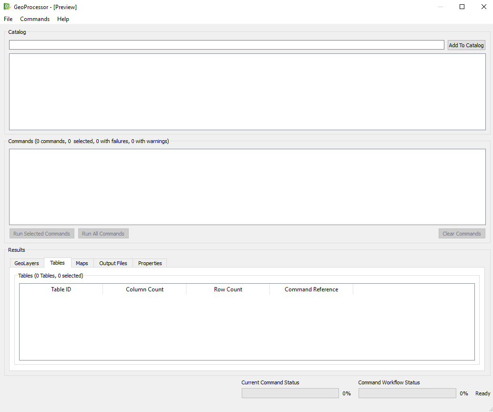
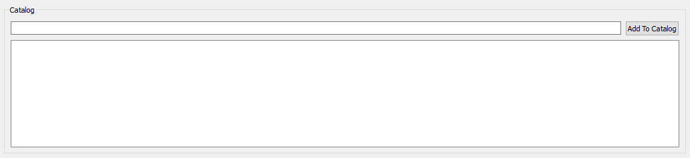
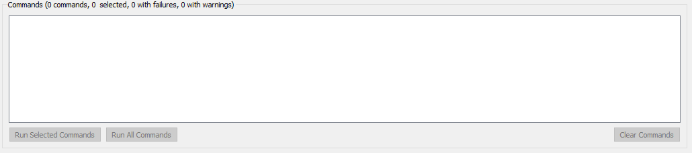
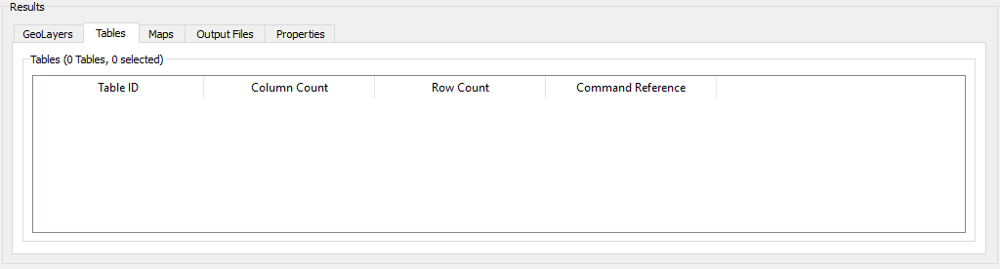
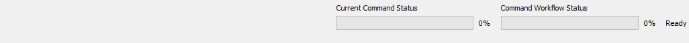
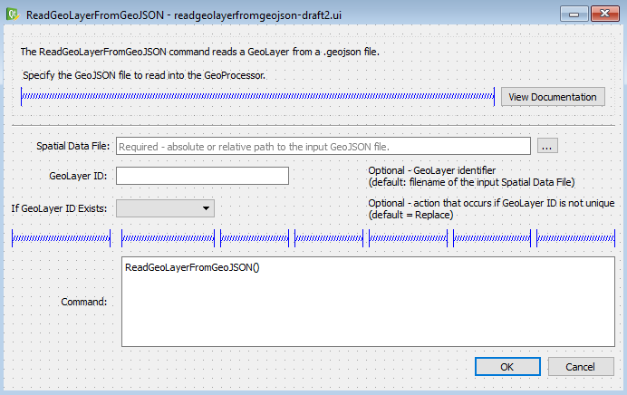

# Building the User Interface (UI)

## Overview 

There are two main components to building the GeoProcessor's user interface.

1. Designing the UI windows
2. Integrating the UI with the GeoProcessor software code 

Both are discussed within this section of the developer documentation. 
It is important to note that this documentation is not a final and complete description of the GeoProcessor's interface. 
The UI is currently under development and this documentation is meant to document the current status of the UI. 
This means that this documentation will be changing frequently until the development of the UI is stable. 

## UI Design

This section will discuss the first main component to building the GeoProcessor's user interface - designing the UI windows.

### UI Designer Software

[Qt Designer - version 4.8.5](http://doc.qt.io/archives/qt-4.8/designer-manual.html) was used to design the UI interface. Qt Designer is an application that lets users build a UI window with a graphical display rather than relying on "from scratch" code. Once a window has been created, the Qt Designer saves the window configurations as a `.ui` file. 

* As described by [FileInfo](https://fileinfo.com/extension/ui) a user interface file (`.ui`) "stores the user interface configuration for a program; saved in an XML format and contains definitions of Qt widgets with slots and signals; can be viewed in a basic text editor or opened with a UI designer program." 

`.ui` files are then converted into Python files to be used within the GeoProcessor software. Refer to the [Conversion of UI  File to Python File](#conversion-of-ui-file-to-python-file) section of this documentation to learn more about the specific steps to take to do this conversion. The Python files (`.py`) are then incorporated with the GeoProcessors' software code within the `geoprocessor/ui` folder. 

There is no need to create one `.ui` file for each required dialog window because many of the dialog windows will share the same design. 
For example, each GeoProcessor command requires a dialog window for the user to enter the input parameters. 
The design and layout of each of the command dialog windows is standardized (see the [Command Dialog Windows](#command-dialog-windows) section). 
After the first command dialog window is built within the Qt Designer, saved as a `.ui` file and then converted into a Python file, that end-product Python file can be used as the template for the other command dialog windows. 
Below is a list of available templates of user interface windows that have been built within the Qt Designer software. They are saved under the `geoprocessor/ui/templates` folder.

|UI Window Type|File Name (.ui, .py) &nbsp;&nbsp;&nbsp;&nbsp;&nbsp;&nbsp;&nbsp;&nbsp;&nbsp;&nbsp;&nbsp;&nbsp;&nbsp;&nbsp;&nbsp;&nbsp;&nbsp;&nbsp;&nbsp;&nbsp;&nbsp;&nbsp;&nbsp;&nbsp;&nbsp;&nbsp;&nbsp;&nbsp;&nbsp;&nbsp;&nbsp;&nbsp;&nbsp;&nbsp;&nbsp;&nbsp;&nbsp;&nbsp;&nbsp;&nbsp;&nbsp;&nbsp;&nbsp;&nbsp;&nbsp;&nbsp;&nbsp;&nbsp;&nbsp;&nbsp;&nbsp;&nbsp;&nbsp;&nbsp;&nbsp;&nbsp;&nbsp;&nbsp;&nbsp;&nbsp;&nbsp;&nbsp;&nbsp;&nbsp;&nbsp;&nbsp;&nbsp;&nbsp;&nbsp;&nbsp;&nbsp;|Use as a template for ... |
|-|-|-|
|GeoProcessor Main Window|`template_mainWindow.ui`, `template_mainWindow.py`|Not applicable. Only one main window.|
|Command Dialog Window (One Tab)|`template_cmdDialogOneTab.ui`, `template_cmdDialogOneTab.py`|Any GeoProcessor command that has a single set of input parameters. For example: `ReadGeoLayerFromGeoJSON` command always requires the same set of input parameter values.|
|Command Dialog Window (Multiple Tab)|`template_cmdDialogMultiTab.ui`, `template_cmdDialogMultiTab.py`|Any GeoProcessor command that has multiple sets of input parameters. For example: `ReadGeoLayersFromFGDB` command has a specific set of input parameters if reading *only one GeoLayer* from the File GeoDatabase and another set of input parameters if reading *multiple GeoLayers* from the File GeoDatabase.|


### Main Window

The GeoProcessor UI has a main window that opens when a user starts the GeoProcessor software. 
This window is the main driver for users to interact with the GeoProcessor. 
The main window has *buttons* to push, *menu options* to select and *tabs* to iterate through. 

|Main Window UI Feature|Description|Example|
|-|-|-|
|Button|A box with text for that completes an action when clicked by the user.|`Run All Commands` runs all of the commands in the current workflow.|'
|Menu Option|A tab in the menu bar (can be nested tabs) that completes an action when clicked by the user.|`Commands > GeoLayers > Read > ReadGeoLayerFromGeoJSON` opens the `ReadGeoLayerFromGeoJSON` command dialog window.|
|Tab|A tab in a display window (the window has multiple tabs) that displays different information when clicked depending on the tab selected.|`Results - Output Files` displays a list of the output files in the Results section. `Results - Properties` displays a list of the properties in the same Results section.|

Below is the current structure of the GeoProcessor's main window. 
Note that this is not a final product but provides an understanding of the basic layout of the main window. 



**<p align="center">GeoProcessor UI Main Window - Preview (<a href = "../gp-ui-mainwindow.png">see also the full-size image</a>)</p>**

The GeoProcessor main window is divided into 4 sections (moving from the top of the window to the bottom of the window). 

1. **Catalog**: space to view the **input files** of the GeoProcessor. 

	
	**<p align="center">GeoProcessor UI Catalog Section - Preview (<a href = "../gp-ui-catalog.png">see also the full-size image</a>)</p>**
	The user can input a local file and view various properties of that file. 
	For example, if the user inputs a File GeoDatabase, a list of the available feature classes and corresponding attributes will appear. 
	*Note: the specifics of the Catalog section have not yet been designed. 
	As of current, there is space carved out on the main window UI for the catalog but more features need to be discussed and added.*

	
2. **Commands**: space to view the **command workflow**. 

	**<p align="center">GeoProcessor UI Commands Section - Preview (<a href = "../gp-ui-commands.png">see also the full-size image</a>)</p>**
	This is the most used section of the user interface. 
	Users build their workflow within this space. 
	Commands are selected from the main window menu bar and, as the inputs are filled out, the command lines are added to the commands section for viewing.
	Users can manipulate their workflow in this section and also run their workflow with the available buttons. 


3. **Results**: space to view the **output products and other results** of the command workflow. 

	**<p align="center">GeoProcessor UI Results Section - Preview (<a href = "../gp-ui-results.png">see also the full-size image</a>)</p>**
	All output products and their corresponding attributes are displayed in this section. The section is tabbed so that output products can be sorted by their type. The results tabs are as follows:

	* GeoLayers: a list of all of the GeoLayers within the GeoProcessor after the workflow has completed its run. GeoLayers removed from the GeoProcessor during the workflow using the `FreeGeoLayers()` command are not included in this tab. 
	* Tables: a list of all of the Tables within the GeoProcessor after the workflow has completed its run.
	* Maps: a list of all of the Maps within the GeoProcessor after the workflow has completed its run.
	* Output Files: a list of output products created by the workflow. This displays all products that were created by running the `WriteXXXToYYY()` commands where XXX is a GeoProcessor object (GeoLayer, Table, etc.) and YYY is an output file format. 
	* Properties: a list of all of the GeoProcessor properties after the workflow has completed its run. 


4. **Status**: space to view the current status of the workflow run. 

	**<p align="center">GeoProcessor UI Status Section - Preview (<a href = "../gp-ui-status.png">see also the full-size image</a>)</p>**
	This section displays the percent completion of the command workflow as it is processing. This section is designed to give the user context about the status of the running workflow. 
	
### Command Dialog Windows  

A menu bar option titled `Commands` in the GeoProcessor's main window menu bar is used to access each of the GeoProcessor's commands. 
The `Commands` menu tab is sub-divided to assist users in finding the desired command. 
Below is the current structure of the `Commands` menu tab. *Note that this is not a complete outline of the `Commands` menu tab structure. 
More sub-tabs are to be added as the UI is developed.*

```
Commands				contains all GeoProcessor commands
	GeoLayers			contains all commands associated with GeoLayers
		Read			contains all commands associated with reading GeoLayers
		Process			contains all commands associated with manipulating GeoLayers
		Write			contains all commands associated with writing GeoLayers
	Tables				contains all commands associated with Tables
		Read			contains all commands associated with reading Tables
		Process			contains all commands associated with manipulating Tables
		Write			contains all commands associated with writing Tables
	General- Comments	contains all commands associates with creating comments in the workflow
```
	 

Each command dialog window is designed in a similar layout to contribute to UI design standardization. 
Many of the design decisions for the command dialog windows were mirrored by those in the [TsTool software](http://learn.openwaterfoundation.org/owf-learn-tstool/).
Below is an example of a GeoProcessor dialog window (`ReadGeoLayerFromGeoJSON` command) within the Qt Designer environment.


**<p align="center">UI Dialog Window Design Example (<a href = "../gp-ui-dialog-design.png">see also the full-size image</a>)</p>**

Each dialog window follows these design rules:

|Design Rule&nbsp;&nbsp;&nbsp;&nbsp;&nbsp;&nbsp;&nbsp;&nbsp;&nbsp;&nbsp;&nbsp;&nbsp;&nbsp;&nbsp;&nbsp;&nbsp;&nbsp;&nbsp;&nbsp;&nbsp;&nbsp;&nbsp;&nbsp;&nbsp;&nbsp;&nbsp;&nbsp;&nbsp;&nbsp;&nbsp;&nbsp;&nbsp;&nbsp;&nbsp;&nbsp;&nbsp;|Description|
|-|-|
|Grid Layout for Dialog Window|Each command dialog window ([`QDialog`](http://doc.qt.io/archives/qt-4.8/qdialog.html)) must utilize the grid layout ([`QtGui.QGridLayout`](http://doc.qt.io/archives/qt-4.8/qgridlayout.html)).|
|Frame at top of Dialog Window|Each command dialog window must have a frame ([`QFrame`](http://doc.qt.io/archives/qt-4.8/qframe.html)) at the top of the window. This will be used to provide a description of the command. This frame should be named `Command_Description`.|
|Grid Layout for `Command_Description`|The `Command_Description` frame ([`QFrame`](http://doc.qt.io/archives/qt-4.8/qframe.html)) must utilize the grid layout.|QtGui.QGridLayout|-|`self.gridLayout_2 = QtGui.QGridLayout(self.Command_Description)`|
|`Command_Description` frame must have 3 components|The `Command_Description` frame must have: <br><br> 1. a label ([`QLabel`](http://doc.qt.io/archives/qt-4.8/qlabel.html)) called `Command_Description_Label` that includes a basic description of the command. <br><br> 2. a horizontal spacer (`Spacer`) called `Command_Description_Hrz_Spacer` that lays under the `Command_Description_Label` but left of the `View_Documentation_Button`. <br><br> 3. a button ([`QPushButton`](http://doc.qt.io/archives/qt-4.8/qpushbutton.html)) called `View_Documentation_Button` that includes the `  View Documentation  ` text. This button should lay right of the `Command_Description_Hrz_Spacer` and should link to the online user documentation for that command.|
|A line separates the description from the input|A horizontal line (`Line`) should separate the command description section from the command input section. This `Line` instance should be called `Separator`.|
|Grid Layout for Dialog Window should be 7 columns wide|To create this 7 column wide grid, enter 7 horizonatal spacers in the same column under the `Separator`. You can see this in the above figure with each spacer represented in blue.|
|Command parameters should have unique rows|Each command has input parameters. Each of those input parameters should be assigned to one row of the dialog window under the `Separator`.|
|Command parameter|Each command dialog window should include a `Command` parameter. This command parameter should be the last row of command parameters within the dialog window. It should be separated from the other command parameters by the row of 7 horizontal spacers. The command parameter is made up of a label ([`QLabel`](http://doc.qt.io/archives/qt-4.8/qlabel.html)) called `CommandDisplay_Label` and a text viewer field ([`QTextBrowser`](http://doc.qt.io/archives/qt-4.8/qtextbrowser.html)) that displays the command line as the command parameter inputs are chosen. This is useful for users to see how their choices in the other input fields effect the command line that will be included in the command workflow.|
|Command Input Label should be 1 coulum wide|Each command has input parameters. The name of the input parameters should be included in the dialog window in the first column of the row corresponding with the parameter. It should be a text field ([`QLabel`](http://doc.qt.io/archives/qt-4.8/qlabel.html)) and should be called `XXX_Label` where `XXX` is the name of the parameter. It should occupy column 1.|
|Command Input Field should be 2 columns wide|Each command has input parameters. The input field (QT class will vary depending on input field type ex: [QLineEdit](http://doc.qt.io/archives/qt-4.8/qlineedit.html), [QComboBox](http://doc.qt.io/archives/qt-4.8/qcombobox.html), etc.) should be 2 columns wide occupying column 2 and 3. Remember the first column is already occupied by the Command Input Label.|
|Command Description Label should be 3 columns wide|Each command has input parameters. The description field should be a text field ([`QLabel`](http://doc.qt.io/archives/qt-4.8/qlabel.html)) and should be called `XXX_Description_Label` where `XXX` is the name of the parameter. It should occupy columns 5, 6 and 7. <br><br> The command description should include information on if the input is required/optional, a brief description and, if applicable, the default value.|
|Command Spacer|Column 4 of each input command parameter row should not include *any* items. You can enter a horizontal spacer or leave it blank. It should be a natural space to separate the input field with the command parameter description.| 

Exceptions to the above rules:

* If an input command parameter requires a input value of a local file location (like `SpatialDataFile` in `ReadGeoLayerFromGeoJSON`):
	* The command input field should not be 2 columns wide - it should be 5 columns wide (from column 2 to column 6). 
	* The seventh column should have a browse button ([`QToolButton`](http://doc.qt.io/archives/qt-4.8/qtoolbutton.html)) that open a file selector dialog window for the user to manually browse and select a file from their file explorer. 
	* The Command Description Label should be included within the input data field as [`placeholderText`](http://doc.qt.io/archives/qt-4.8/qlineedit.html#placeholderText-prop). 

## UI Software Integration 

The GeoProcessor software is built in the Python language. 
The user interface files, therefore, must also be in Python in order to integrate the UI with the GeoProcessor code.

### Conversion of UI  File to Python File

The following steps explain how to convert a `.ui` file to a `.py` file:

1. Open OSGeo4W Shell. 
2. Navigate to the folder that contains the `.ui` file that will be converted. 
2. Enter `pyuic4 [name of the input ui file] -o [relative path to the output py file]

### Location of UI Python Files 

The GeoProcessor's Main Window and each of the GeoProcessor commands require a unique user interface design python file. 
Within each python file is a class that configures the appropriate user interface. 
All user interface python files are located within the `geoprocessor/ui` folder. 
Below is the current structure of the `geoprocessor/ui` folder. 

```
geoprocessor/ui			contains all GeoProcessor ui design python files
	app					contains the main window ui design python files
	commands 			contains all of the GeoProcessor commands' ui design python files
		layers			contains the ui design python files for the commands within the geoprocessor/commands/layers folder
		logging			contains the ui design python files for the commands within the geoprocessor/commands/logging folder
		running			contains the ui design python files for the commands within the geoprocessor/commands/running folder
		tables			contains the ui design python files for the commands within the geoprocessor/commands/tables folder
		testing 		contains the ui design python files for the commands within the geoprocessor/commands/testing folder
		util			contains the ui design python files for the commands within the geoprocessor/commands/util folder
	templates			contains the ui design template files (both .py files and .ui files)
```

### Types of Python Files

There are two types of Python files that makes up the user interface (UI) design. 

1. The first interacts with a GeoProcessor instance. It acts as the main communicator with an active session of the GeoProcessor. For the purposes of this documentation, this type of UI Python file is called a `GeoProcessor Interactor` file. 
2. The other type of Python file is responsible for the design and window structure of a UI window. Each UI window (besides message boxes) has an individual Python file that builds its structure. For the purpose of this documentation, this type of UI Python file is called a `Design Builder` file. 

There will be more `Design Builder` files than `GeoProcessor Interactor` files. As mentioned above, one `Design Builder` file is required for each UI window. This means that *each* GeoProcessor command must have its own `Design Builder` file to allow users to build commands and enter command input parameters. As of current, there is only one main `GeoProcessor Interactor` file. This might change if that file becomes too large and unmanageable. 

#### Design Builder File

Each `Design Builder` file is made up of a single class. The name of the class corresponds to the type of Qt window (`Ui_MainWindow`, `Ui_Dialog`, etc.). Note that more than one `Design Builder` file will use the *same* class name. Each class must have, but is not limited to, a `setupUi` function and a `retanslateUi` function. 

* The `setupUI` function builds the window’s infrastructure (buttons, layout, labels, spacing guidelines, etc.). 
* The `retranslateUI` function applies the custom text to the window (label text, tooltips, ComboBox options, etc.). The `retranslateUI` function is always called within the `setupUI` function - after the infrastructure build but before creating the signal/slot connections. 

For more information on the UI layout and design on the `Design Builder` files, refer to the [UI Design](#ui-design) section.

#### GeoProcessor Interactor File

The sole `GeoProcessor Interactor` file is called `launchUI.py`. It has only one class - this class is called `GeoProcessorUI`. The `GeoProcessorUI` class is imported into the `gp.py` file within the `run_ui` function to start up the software's user interface. It is important to note that a GeoProcessor instance must be passed into the `GeoProcesorUI` instance so that the user interface can interact with an active GeoProcessor. 

The `GeoProcessor Interactor` file must import all of the individual classes of the `Design Builder` files so that the accessory windows can be opened with button clicks of the main software window. Remember that the same class names are used for multiple `Design Builder` files. With that being said the classes must be "renamed" via the import. Follow the naming convention below:

```
From [Design Builder File Path] import [Design Builder Class] as [Design Builder Class]_[Design Builder File]
```

Example:
```
from geoprocessor.ui.commands.layers.ReadGeoLayerFromGeoJSON import Ui_Dialog as Ui_Dialog_ReadGeoLayerFromGeoJSON
```

See the following for descriptions on the important `GeoProcesorUI` class variables: 

|Class Variable&nbsp;&nbsp;&nbsp;&nbsp;&nbsp;&nbsp;&nbsp;&nbsp;&nbsp;&nbsp;&nbsp;&nbsp;&nbsp;&nbsp;&nbsp;&nbsp;&nbsp;&nbsp;&nbsp;&nbsp;&nbsp;&nbsp;&nbsp;&nbsp;&nbsp;&nbsp;&nbsp;&nbsp;&nbsp;&nbsp;&nbsp;&nbsp;&nbsp;&nbsp;&nbsp;&nbsp;&nbsp;&nbsp;&nbsp;&nbsp;&nbsp;&nbsp;&nbsp;&nbsp;&nbsp;&nbsp;&nbsp;&nbsp;&nbsp;&nbsp;&nbsp;&nbsp;|Description|
|-|-|
|`total_commands`|The count (int) of workflow commands within the UI commands list (`Commands_List` [QListWidget](http://doc.qt.io/archives/qt-4.8/qlistwidget.html)).|
|`selected_commands`|The count (int) of selected workflow commands within the UI commands list (`Commands_List` [QListWidget](http://doc.qt.io/archives/qt-4.8/qlistwidget.html)).|
|`gp`|An active GeoProcessor instance.|
|`saved_file`|The full path to the filename of the most recently saved file. This variable is set to *None* until the user clicks the `File > Save > Commands As ...` button or the `File > Save > Command ...` button. It is *reassigned* only when the user clicks the `File > Save > Commands As ...` button. This value is used to save the current workflow commands to the most recently saved file by overwriting that file.| 
|`command_dialog_factory_dic`|A dictionary relating each GeoProcessor command with its corresponding `Design Builder` class. The user interface dynamically pulls up different GeoProcessor command windows depending on which buttons/options the user clicks. Many of the buttons/options are specific to a certain GeoProcessor command. The name of the command is looked up in this dictionary as the key and the appropriate `Design Builder` class is returned as the value. |

The above `GeoProcesorUI` class variables are initialized in the `__init__` function. In addition, the `__init__` function defines the main window UI listeners, button/menu clicks and other actions. 
The remaining functions within the `GeoProcesorUI` class are actions that occur in reaction to the main window UI listeners, button/menu clicks and other actions. 

See the following for descriptions on the important `GeoProcesorUI` class functions: 	

|Class Function&nbsp;&nbsp;&nbsp;&nbsp;&nbsp;&nbsp;&nbsp;&nbsp;&nbsp;&nbsp;&nbsp;&nbsp;&nbsp;&nbsp;&nbsp;&nbsp;&nbsp;&nbsp;&nbsp;&nbsp;&nbsp;&nbsp;&nbsp;&nbsp;&nbsp;&nbsp;&nbsp;&nbsp;&nbsp;&nbsp;&nbsp;&nbsp;&nbsp;&nbsp;&nbsp;&nbsp;&nbsp;&nbsp;&nbsp;&nbsp;&nbsp;&nbsp;&nbsp;&nbsp;&nbsp;&nbsp;&nbsp;&nbsp;&nbsp;&nbsp;&nbsp;&nbsp;&nbsp;&nbsp;&nbsp;&nbsp;&nbsp;&nbsp;&nbsp;&nbsp;&nbsp;&nbsp;&nbsp;&nbsp;&nbsp;&nbsp;&nbsp;&nbsp;|Description|
|-|-|
|`new_command_editor(command_name)`|This function responds to the user clicking on any menu option that selects a GeoProcessor command to add to the workflow. Each menu option click that corresponds to a new command calls this function and passed the corresponding command name into the function. The command name is then used in the `command_dialog_factory_dic` to return the correct `Design Builder` file class to display the appropriate [command dialog window](#command-dialog-windows). <br><br>The user interacts with the [command dialog window](#command-dialog-windows) to enter the desired parameter values. Once accepted, the `new_command_editor` function adds the command string (with the desired parameter values) to the workflow command list (`Commands_List` [QListWidget](http://doc.qt.io/archives/qt-4.8/qlistwidget.html)).|
|`edit_command_editor(commad_name)`|This function responds to the `right-click > Edit Command` button. It is only called on a command that has *already* been created via the `new_command_editor` function. <br><br>The pre-defined command string is read and, from that, the command name is determined. The command name is used in the `command_dialog_factory_dic` to return the correct `Design Builder` file class to display the appropriate [command dialog window](#command-dialog-windows). There is a dictionary in each command-specific `Design Builder` file class that holds each parameter name (key) and the corresponding parameter value (value). This dictionary is called `command_parameter_dictionary`. The pre-defined command string is parsed to determine the pre-defined parameter names and values. The `command_parameter_dictionary` is updated with the pre-defined parameter values. A function within the `Design Builder` file class called `refresh()` will populate the dialog window with these pre-defined parameter values. <br><br> The user can then see the previously set parameter values and change them as needed. If they click the `OK` button within the [command dialog window](#command-dialog-windows), the old command will be removed from the workflow command list (`Commands_List` [QListWidget](http://doc.qt.io/archives/qt-4.8/qlistwidget.html)) and the new command will be added to the workflow command list at the same index. |
|`update_gp_command_list(selected=False)`|Passes the UI workflow command list (`Commands_List` [QListWidget](http://doc.qt.io/archives/qt-4.8/qlistwidget.html)) to the GeoProcessor. Can choose to pass *all* commands to the GeoProcessor or only the *selected* commands. |
|`run_commands(selected=False)`|Passes the UI workflow command list to the GeoProcessor, via the `update_gp_command_list` function,  and runs the commands within the GeoProcessor. The UI main window results section is updated with the GeoProcessor's variables (existing GeoLayers, Tables, Output Files, etc.). Can choose to run *all* commands or only the *selected* commands.|
|`update_command_count()`|This function is called often. It updates the command count (both total and selected). Buttons are enabled/disabled depending on the command count. For example, `Run all commands` is enabled *only if* one or more commands are in the workflow command list (`Commands_List` [QListWidget](http://doc.qt.io/archives/qt-4.8/qlistwidget.html)).|
|`update_results_count()`|This function is similar to the `update_command_count` function. It counts the number of items (total and selected) in each Result table and changes the Result Table labels to display the dynamic information.|

